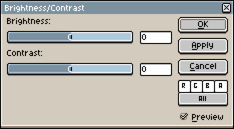
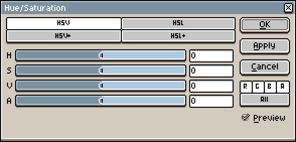
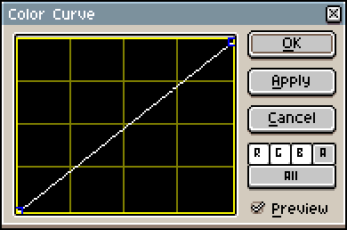

# Adjustments

The Adjustments dropdown can be accessed with *Edit > Adjustments*, and it contains various options to adjust the colors of the sprite.

## Brightness/Contrast

Adjusts the brightness and contrast of the sprite or selection. A negative value will decrease the brightness/contrast while a positive value will increase the brightness/contrast.

* The *R*, *G*, *B*, and *A* buttons control if a component should be affected, e.g: the *R* button is checked, so the *R* (red) component will be adjusted.
* The bottom button controls if the adjustment should apply to the active timeline selection (*Selected*) or all of the cels in the sprite (*All*). If [a portion of a sprite is selected](selecting.md#selecting): in *Selected* mode it would only apply to the selected content of the selected timeline elements; in *All* mode it would apply to the selected content of all of the sprite's cels.

    

## Hue/Saturation

Adjusts the hue, saturation, and value/lightness of the sprite or selection. 

* HSV / HSL: Increases a HSV/L component by a percentage of the components value
    > e.g: a color has a Value of `20` increasing by `10%` of `20`; the resulting Value would be `20` + `2`, or `22`.
* HSV+ / HSL+: Increases a HSV/L component by the specified amount
    > e.g: a color has a Value of `5` increasing by `14`; the resulting Value would be `5` + `14`, or `19`.

## Color Curve

Applies a color curve to the sprite or selection. 

Clicking anywhere in the box will create a new point. <kbd>Left click</kbd> and drag a point to move it; <kbd>Right click</kbd> a point to edit its properties. To delete a point, hover over a point and press <kbd>Delete</kbd>.

---

**SEE ALSO**

[FX](fx.md#fx) |
[Edit Menu](edit-menu.md#edit-menu)