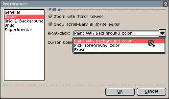

# Basics

Here you can learn the basics principles behind Aseprite.

In Aseprite a [sprite](sprite.md)  is a sequence of frames and a stack of layers.
Each frame-layer intersection is called a [cel](cel.md).

This is a general overview of the [timeline](timeline.md):

## Workflow

The basic [workflow](workflow.md) is:

* [Create a new sprite](new-sprite.md) from *File > New* menu.
* [Draw](drawing.md) with pencil tool  using
  `Left click` or `Right click`, and pick colors from the
  [color bar](color-bar.md) using those same buttons.
* Save your work from *File > Save* menu as a
  `.ase` file to preserve all your image information (layers, frames,
  etc.).
* [Export your sprite](exporting.md) as a `.gif` file to publish your image on a
  website, or `.png` to save a sequence of files, or as a `.png`
  [sprite sheet](sprite-sheet.md), etc.

See the [workspace](workspace.md) to know more about the elements
in the window. See [workflow](workflow.md) section for more details.

## A hand on the keyboard

You should put your left hand on the keyboard *(or your right hand if
you are left-handed)*. As there are some handy keyboard shortcuts, you
can use them from the very beginning to make a better use of Aseprite:

* Keys `1`, `2`, `3`, `4`, `5`, and `6` can be used to change the [zoom](zoom.md)
  (you can use the Mouse Wheel to change zoom too).
* `B` key is the Pencil tool, and `M` the rectangular marquee, maybe the
  most common tools that you will use.
* You can pick colors with `Alt` + click.
  E.g.
  `Alt+Left click` changes the Foreground Color,
  `Alt+Right click` changes the Background Color (Eyedropper tool ).
* The `Ctrl` key (or `⌘` on Mac OS X) can be used to select the [Move tool](move-tool.md) .
  With it you can easily select or move layers.

## Alternative functions for right-click

By default, `Right click` paints with the Background Color,
but you can change this configuration from *Edit > Preferences > Editor*:

---

**SEE ALSO**

[Workspace](workspace.md) |
[Workflow](workflow.md) |
[Sprite](sprite.md)
