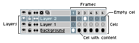

# Basics

Here you can learn the basics principles behind Aseprite.

In Aseprite, a [sprite](sprite.md) consists of a sequence of frames
and a stack of layers. The intersection of frames and layers creates
an array of editable graphic [cels](cel.md) with images/pixels that
can be [edited](drawing.md) with the [sprite editor](sprite-editor.md). Layers, frames,
and cels are visible in the [timeline](timeline.md):

## Basic Elements of a Sprite

A [frame](frames.md) is a single still image in a sprite. Adding and altering frames creates a sequence of images called an [animation](animation.md). The details of how Aseprite cycles through frames is described in greater detail in the [animation section](animation.md). Frames are represented horizontally in the timeline, from left to right.

Each frame's image is produced from a stack of one or more [layers](layers.md), represented in order from bottom to top on the timeline. Layers at the top of the timeline are drawn first, and every subsequent layer is added over top of it. Layers assist you by divide a single complex image into separate graphic component parts.

Each frame-layer intersection is called a [cel](cel.md). The contents of any specific cel may be moved, edited, and deleted without effecting the contents of other cels, which make them ideal for isolating and editing specific elements of a graphic while preserving parts that do not change.

## Workflow

The basic [workflow](workflow.md) is:

* [Create a new sprite](new-sprite.md) from *File > New* menu.
* [Draw](drawing.md) with pencil tool  using
  `Left click` or `Right click`, and pick colors from the
  [color bar](color-bar.md) using those same buttons.
* [Save your work](save.md) from *File > Save* menu as an
  `.ase` file to preserve all your image information (layers, frames,
  etc.. Also stores certain [workspace](workspace.md) preferences.).
* [Export your sprite](exporting.md) as a `.gif` file to publish your image on a
  website, as a numbered sequence of individual `.png` files (one file per frame), or as a single `.png` file with all frames arranged in a single row or column, or as a 2-D [sprite sheet](sprite-sheet.md).

 You may choose from any of several other file formats during _Save As_ and _Export _as well, depending on your colour depth choices and personal preferences!)

See the [workspace](workspace.md) to know more about the elements
in the window. See [workflow](workflow.md) section for more details.

## A hand on the keyboard

You should put your left hand on the keyboard *(or your right hand if
you are left-handed)*. As there are some handy keyboard shortcuts, you
can use them from the very beginning to make a better use of Aseprite:

* Keys `1`, `2`, `3`, `4`, `5`, and `6` can be used to change the [zoom](zoom.md)
  (you can use the Mouse Wheel to change zoom too).
* `B` key is the Pencil tool, and `M` the rectangular marquee, maybe the
  most common tools that you will use.
* `Alt+click` allows you to pick colours from the active image using the Eyedropper tool :
  `Alt+Left click` samples the Foreground Color,
  `Alt+Right click` samples the Background Color.
* The `Ctrl` key (or `⌘` on macOS) can be used to select the [Move tool](move-tool.md) .
  With it you can easily select or move layers.
* The `Tab` key hides and reveals the [timeline](timeline.md). If your timeline is ever missing, this is the fastest way to reveal it!
* Holding `Spacebar` as you `Left click+Drag` will pan your view of the sprite you are currently editing. Useful when you're working on large graphics or are zoomed-in.

## Alternative functions for right-click

By default, `Right click` paints with the [Background Color](color-bar.md#background-color),
but you can change this configuration from [*Edit > Preferences > Editor*](right-click.md).

---

**SEE ALSO**

[Workspace](workspace.md) |
[Workflow](workflow.md) |
[Sprite](sprite.md)
