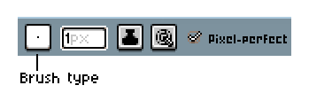
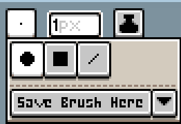
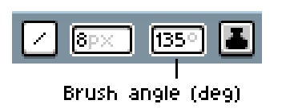
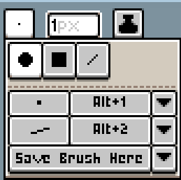
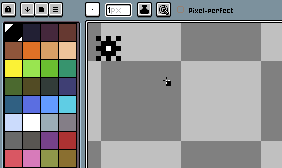
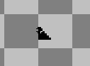
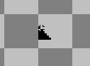
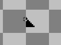

# Brushes
To view available brushes, select any painting tool and click on the brush type option in the [context bar](context-bar.md). 

## Brush types

The top three buttons are the three brush types. By default, it is set to the round type. The square and line types have a context bar option that changes the angle, in degrees.

## Custom type brushes

The bottom button saves the current brush you are using as a custom brush. After you have saved a brush, the menu will display it in the brush menu.

If your brush is saving blank, you likely saved the brush with incomplete parameters.

## Custom pattern brushes

You can create a custom brush from a pattern by going to *Edit > New Brush* or by pressing <kbd>Ctrl+B</kbd>. You can then choose to copy or cut a portion of the sprite. Upon first selecting the brush, the pattern will be a direct copy of the copied portion. If you select a color, the entire brush shape will become that color. 

When using a pattern brush, a dropdown on the context bar can control how the pattern is drawn.

| | | |
|-|-|-
| *Pattern aligned to source* | Aligns the pattern to the location it was copied/cut from. | 
| *Pattern aligned to destination* | Aligns the pattern to where it was placed. | 
| *Paint brush* | Acts like a regular brush. | 

## Brush Parameters

You can set the parameters a new brush is saved with by clicking on the dropdown next to the "Save Brush Here" button. To  edit/overwrite a brush's individual parameters, click the dropdown next to it, unlock it, and then click "Save Brush Here" (in the dropdown) to save it and overwrite the old parameters. 

If a parameter is enabled, the corresponding option is saved. 

| Parameter | Description
| -------- | -------------
| ***Brush:** Type* | Saves the brush type.
| ***Brush:** Size* | Saves the brush size.
| ***Brush:** Angle* | Saves the brush angle.
| ***Color:** Foreground* | Saves the foreground color with the brush. The foreground color will be switched to this when the brush is selected. Only works for type brushes.
| ***Color:** Background* | Saves the background color. The background color will be switched to this when the brush is selected. Only works for type brushes.
| ***Color:** Image Color* | Saves the color(s) of the brush. Only works for pattern brushes.
| ***Ink:** Type* | Saves the [ink](ink.md) type.
| ***Ink:** Opacity* | Saves the ink opacity.
| ***Extras:** Shade* | Saves the [shade](shading.md) gradient.
| ***Extras:** Pixel-Perfect* | If enabled, it will save the state of pixel-perfect mode, not enable pixel-perfect mode outright.

----

**SEE ALSO**

[Context Bar](context-bar.md) |
[Dynamics](dynamics.md) |
[Ink](ink.md)
