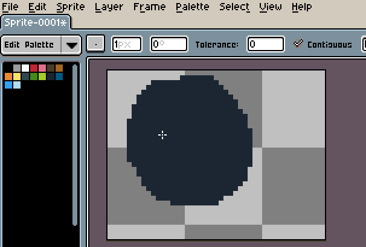

# Canvas Size

The canvas is the visible area of the sprite. You can change the
canvas size using _Sprite > Canvas Size..._ menu.

<!-- PREVIEW: GIF, change canvas size to a bigger one, with previously placed sprite that is only partially visible in the original, small canvas and being shown in full after the change -->

In this window you can change the `Width` or `Height` manually, or
using the blue rules in the editor window.

## Crop

You can change the canvas size using the current selection bounds:

<!-- PREVIEW: GIF, crop canvas from side and bottom, with a sprite miming leaning on a wall -->

## Trim

You can remove transparent borders from canvas automatically
using the _Sprite > Trim_ menu.

<!-- PREVIEW: GIF, trim canvas with a sprite miming being enclosed in a box -->

