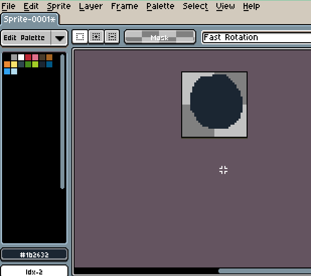
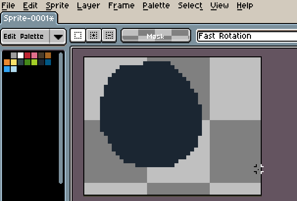
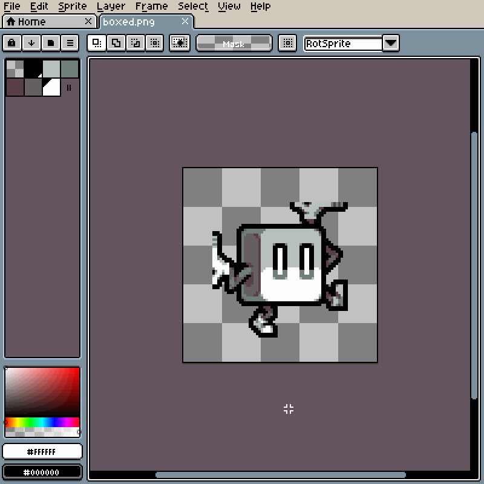

# Canvas Size

The canvas is the visible area of the sprite. You can change the
canvas size using *Sprite > Canvas Size...* menu.

> Note: Resizing the canvas updates all slices accordingly, changing their position.

In this window you can change the `Width` or `Height` manually, or
using the blue rules in the editor window.

## Crop

You can change the canvas size using the current selection bounds:

## Trim

You can remove transparent borders automatically from the canvas
using the *Sprite > Trim* menu.

