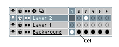
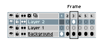
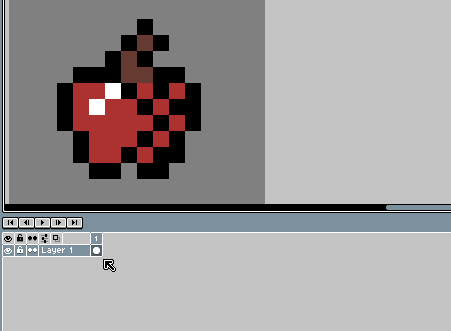
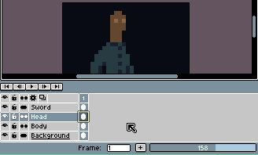

# Cel

A cel (from [celluloid](http://en.wikipedia.org/wiki/Cel)) is one
image in a specific frame and layer, at a specific *xy*-coordinate in
the canvas.

The difference between a frame and a cel, is that a frame is the set of
cels for all layers in a specific time:

## Move a Cel

You can use the [Move tool](move-tool.md) to drag-and-drop the current
cel in the canvas. Or you can use the [Timeline to move the cel](move-cels.md) to
other layer/frame position.

## Change Opacity

On [RGB](color-mode.md#rgb) images each cel has its own opacity
level. You can use the slider at the status bar to modify its opacity:

You can do the same right-clicking a cel and selecting *Properties* option (or *Frame > Cel Properties* menu):

----

**SEE ALSO**

[Linked Cels](linked-cels.md) |
[Timeline](timeline.md)
