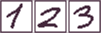
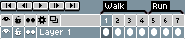

# Aseprite Command Line Interface

You can convert or export your sprites to other formats (or
textures+json data) from the command line.  See
[Platform-specific Details](#platform-specific-details) section to
know how to use the command line.

* [Options](#options)
* [Use Cases](#use-cases)
* [Platform-specific Details](#platform-specific-details)
* [Automating the process](#automating-the-process)

# Options

<pre>
Usage:
  aseprite.exe [OPTIONS] [FILES]...

Options:
      --<a href="#shell">shell</a>                  Start an interactive console to execute scripts
  -b, --<a href="#batch">batch</a>                  Do not start the UI
  -p, --<a href="#preview">preview</a>                Do not execute actions, just print what will be
                               done
      --<a href="#save-as">save-as</a> &lt;filename&gt;     Save the last given sprite with other format
      --<a href="#palette">palette</a> &lt;filename&gt;     Change the palette of the last given sprite
      --<a href="#scale">scale</a> &lt;factor&gt;         Resize all previously opened sprites
      --<a href="#data">data</a> &lt;filename.json&gt;   File to store the sprite sheet metadata
      --<a href="#format">format</a> &lt;format&gt;        Format to export the data file (json-hash, json-array)
      --<a href="#sheet">sheet</a> &lt;filename.png&gt;   Image file to save the texture
      --<a href="#sheet-width">sheet-width</a> &lt;pixels&gt;   Sprite sheet width
      --<a href="#sheet-height">sheet-height</a> &lt;pixels&gt;  Sprite sheet height
      --<a href="#sheet-pack">sheet-pack</a>             Use a packing algorithm to avoid waste of space
                               in the texture
      --<a href="#split-layers">split-layers</a>           Import each layer of the next given sprite as
                               a separated image in the sheet
      --<a href="#layer">layer</a> &lt;name&gt; or
      --<a href="#import-layer">import-layer</a> &lt;name&gt;    Include just the given layer in the sheet
      --<a href="#frame-tag">frame-tag</a> &lt;name&gt;       Include tagged frames in the sheet
      --<a href="#ignore-empty">ignore-empty</a>           Do not export empty frames/cels
      --<a href="#border-padding">border-padding</a> &lt;value&gt; Add padding on the texture borders
      --<a href="#shape-padding">shape-padding</a> &lt;value&gt;  Add padding between frames
      --<a href="#inner-padding">inner-padding</a> &lt;value&gt;  Add padding inside each frame
      --<a href="#trim">trim</a>                   Trim all images before exporting
      --<a href="#crop">crop</a> x,y,width,height  Crop all the images to the given rectangle
      --<a href="#filename-format">filename-format</a> &lt;fmt&gt;  Special format to generate filenames
      --<a href="#list-layers">list-layers</a>            List layers of the next given sprite
                               or include frame tags in JSON data
      --<a href="#list-tags">list-tags</a>              List tags of the next given sprite sprite
                               or include frame tags in JSON data
  -v, --<a href="#verbose">verbose</a>                Explain what is being done
      --<a href="#debug">debug</a>                  Extreme verbose mode and copy log to desktop
  -?, --<a href="#help">help</a>                   Display this help and exits
      --<a href="#version">version</a>                Output version information and exit
</pre>

## --shell

Executes Aseprite in a
[REPL mode](https://en.wikipedia.org/wiki/Read%E2%80%93eval%E2%80%93print_loop). You
can write JavaScript code in this mode. There are plans for a
[specific API](https://github.com/aseprite/api-draft) for future version.

## --batch

Runs Aseprite only to process command line options, then
finishes. It's specially useful if you are running Aseprite from a
script to automate sprite sheet generation, image conversion, etc.
Example:

    aseprite --batch

Or you can use the shorter form:

    aseprite -b

## --preview

On **v1.2-beta2**: Only show what will be done (doesn't modify files
in disk).

    aseprite --preview ...

## --save-as

Saves the latest opened document with the given file name. It's like
calling `File > Save As` from the interface.  Example:

    aseprite -b sprite.ase --save-as frame001.png

Will generate `frame001.png`, `frame002.png`, etc. for each frame in `sprite.ase`.

On **v1.2-beta1**: You can specify
[--filename-format](#filename-format) parameters in the filename
directly. For example:

    aseprite -b sprite.ase --save-as layer-{layer}-frame-{frame01}.png

It's like using [--split-layers](#split-layers) and
[--filename-format](#filename-format) implicitly.

## --palette

On **v1.2-beta2**: Changes the color palette of the last given sprite
in the command. It can be used to save one sprite with different color
palettes:

    aseprite -b ryu-template.png --palette pal1.png --save-as ryu1.png --palette pal2.png --save-as ryu2.png

On **v1.1** this parameter was used to change the default program
palette, but it can be done now using the
*[Save as Default Palette](default-palette.md)* menu option.

## --scale

    aseprite ... --scale FACTOR

Resizes all images with the given `FACTOR` specified before
`--scale` option in the command line. Example:

    aseprite -b original.png --scale 2 --save-as image-x2.png

## --data

    aseprite.exe ... --sheet file.png --data file.json

Saves information about the exported sprite sheet in a JSON
format. [Output example.](https://gist.github.com/dacap/db18e5747a4b6e208d3c)

See [--sheet](#sheet) option to change the destination of the sprite sheet image.

## --format

Changes the format used to shave the sprite sheet data specified in
[--data](#data) option. Available formats are:

* `--format json-hash` (default format) ([example](https://gist.github.com/dacap/db18e5747a4b6e208d3c))
* `--format json-array` ([example](https://gist.github.com/dacap/a32adb9248320326733a))

## --sheet

    aseprite ... --sheet SPRITESHEET.png

Exports all images specified in the command line before the `--sheet`
option in the `SPRITESHEET.png` image (the file will be overwritten).

See [--data](#data) option to change the destination of the sprite sheet JSON data.

## --sheet-width

Specifies a fixed width (in pixels) for the sprite sheet in [--sheet](#sheet).

## --sheet-height

Specifies a fixed height (in pixels) for the sprite sheet in [--sheet](#sheet).

## --sheet-pack

Calculates the best texture size (width and height) for the sprite sheet in [--sheet](#sheet).
The width and height will be powers of two.

## --split-layers

Splits the next document layers. It affects [--sheet](#sheet) and [--save-as](#save-as)
options.

Example:

    aseprite.exe -b --split-layers with-layers.ase --save-as output1.png

If `with-layers.ase` contains 3 frames and layers `Background` and `Layer 1`,
the following command will generate 6 files (one for each frame/layer):

    output (Background) 1.png
    output (Background) 2.png
    output (Background) 3.png
    output (Layer 1) 1.png
    output (Layer 1) 2.png
    output (Layer 1) 3.png

On **v1.2-beta1**: If you specify `{layer}` in the
[--save-as](#save-as) filename, the `--split-layers` is implicitly
used. For example

    aseprite.exe -b with-layers.ase --save-as output-{layer}-{frame}.png

## --layer

Selects just one layer to be exported (hides all other layers). It
affects [--sheet](#sheet) and [--save-as](#save-as) options.

    aseprite.exe -b --layer "Body Layer" with-layers.ase --save-as body-layer.gif

Saves a `body-layer.gif` animation showing only the layer called `Body Layer`.

On **v1.2-beta2** you can specify multiple layers and/or groups:

    aseprite.exe -b --layer "head/hat" --layer "body/gloves" player.ase --save-as clothes.gif

Will save a `clothes.gif` animation showing only the `hat` layer
(which is a child of `head` group) and `gloves` layer which is a child
of `body` group.

## --frame-tag

Exports the frames inside the given tag only. It works for
[--sheet](#sheet) on **v1.1**, and it works for [--save-as](#save-as) since
**v1.2-beta1**.

## --ignore-empty

Ignores empty frames/layers. It affects [--sheet](#sheet) option only.

## --border-padding

    aseprite ... --border-padding N ...

Includes a border for the whole sheet of N pixels. It affects [--sheet](#sheet) option only.

## --shape-padding

    aseprite ... --shape-padding N ...

Includes a separation between each frame of N pixels. It affects [--sheet](#sheet) option only.

## --inner-padding

    aseprite ... --inner-padding N ...

Includes a border to each frame of N pixels. It affects [--sheet](#sheet) option only.

## --trim

Removes borders from sprites/layers/cels before save
them. (I.e. executes the *Edit > Trim* option for each image to be
exported.)  It affects [--sheet](#sheet) and [--save-as](#save-as)
options.

## --crop

    aseprite ... --crop X,Y,WIDTH,HEIGHT

Exports only the specified rectangle from all sprites/layers/cels. It
affects [--sheet](#sheet) and [--save-as](#save-as) options.

## --filename-format

    aseprite --filename-format FORMAT

This option specifies the special string used to format filenames
generated in sprite sheets on [--sheet](#sheet) or files generated on
[--save-as](#save-as).

The `FORMAT` string can contain some special values:

* `{fullname}`: Original sprite full filename (path + file + extension).
* `{path}`: Path of the filename. E.g. If the sprite filename is `C:\game-assets\file.ase` this will be `C:\game-assets`.
* `{name}`: Name (including extension) of the filename. E.g. If the sprite filename is `C:\game-assets\file.ase` this will be `file.ase`.
* `{title}`: Name without extension of the filename. E.g. If the sprite filename is `C:\game-assets\file.ase` this will be `file`.
* `{extension}`: Extension of the filename. E.g. If the sprite filename is `C:\game-assets\file.ase` this will be `ase`.
* `{layer}`: Current layer name.
* `{tag}`: Current tag name.
* `{innertag}`: Smallest/inner current tag name.
* `{outertag}`: Largest/outer current tag name.
* `{frame}`: Current frame (starting from `0`). You can use `{frame1}` to start from 1, or other formats like `{frame000}`, or `{frame001}`, etc.
* `{tagframe}`: The current frame in the current tag. It's `0` for the first frame of the tag, and so on. Same as `{frame}`, it accepts variants like `{tagframe000}`.

For example, if `animation-with-layers.ase` contains three frames with two layers (named `Face` and `Background`):

    aseprite -b animation-with-layers.ase --filename-format '{path}/{title}-{layer}-{frame}.{extension}' --save-as output.png

Will generate files like:

    output-Face-0.png
    output-Face-1.png
    output-Face-2.png
    output-Background-0.png
    output-Background-1.png
    output-Background-2.png

On **v1.2-beta1**: You can specify the filename format in the same
[--save-as](#save-as) argument.

## --list-layers

    aseprite --list-layers file.ase

Prints the list of layers in the given file from bottom to top. E.g.

    C:\....> aseprite -b --list-layers file.ase
    Background
    Layer 1
    Layer 2

When used with [--data](#data), the layers will be available in the
JSON output in the `meta` attribute. E.g.

    { "frames": [
      ...
     ],
     "meta": {
      ...,
      "layers": [
       { "name": "Background" },
       { "name": "Layer 1" },
       { "name": "Layer 2" }
      ]
     }
    }

## --list-tags

    aseprite --list-tags file.ase

Prints the list of tags in the given file from the first one to the last one. E.g.

    C:\....> aseprite -b --list-tags file.ase
    Walk
    Run

When used with [--data](#data), the tags will be available in the JSON
output in the `meta` attribute. E.g.

    { "frames": [
      ...
     ],
     "meta": {
      ...,
      "frameTags": [
       { "name": "Walk", "from": 0, "to": 3 },
       { "name": "Run", "from": 4, "to": 6 }
      ]
     }
    }

## --debug

If you execute Aseprite with the `--debug` parameter in the command
line, a special `Aseprite-v1.1-dev-DebugOutput.txt` file will be
created in your desktop with possible useful information to know what
problem is going on (e.g. this is useful to know what is going on in
case that the program don't start correctly).

On Steam, you can add this `--debug` option [from the Aseprite
properties](http://imgur.com/txXcgzO).

## --verbose

    aseprite --verbose

It will log more information in the `aseprite.log` file:

* On Windows: `aseprite.log` is located in `%AppData%\Aseprite\aseprite.log`
* On Mac OS X and Linux: `aseprite.log` is located in `~/.config/aseprite/aseprite.log`

## --help

    aseprite --help

Shows available command line options in the console output.

## --version

    aseprite --version

Shows Aseprite version.

# Use Cases

## Convert Aseprite files into PNG, GIF, etc.

    aseprite.exe -b image.ase --save-as image.png
    aseprite.exe -b animation.ase --save-as animation.gif

## Convert an animation to a sequence of PNG files (frame1.png, frame2.png, etc.)

    aseprite.exe -b animation.ase --save-as frame1.png

## Resize one sprite to several dimensions

    aseprite.exe -b original.ase --scale 2 --save-as output-x2.png
    aseprite.exe -b original.ase --scale 4 --save-as output-x4.png
    aseprite.exe -b original.ase --scale 6 --save-as output-x6.png
    aseprite.exe -b original.ase --scale 8 --save-as output-x8.png

## Export one layers to PNG/GIF files

    aseprite.exe -b --layer "Layer 1" animation.ase --save-as output-Layer-1.gif

## Export all layers into different PNG/GIF files

If `animation.ase` contains 3 frames and layers `Background` and `Layer 1`,
the following command will generate 6 files (one for each frame/layer):

    aseprite.exe -b --split-layers animation.ase --save-as output1.png

Generated files will be:

    output (Background) 1.png
    output (Background) 2.png
    output (Background) 3.png
    output (Layer 1) 1.png
    output (Layer 1) 2.png
    output (Layer 1) 3.png

On **v1.2-beta1**: You can specify [--split-layers](#split-layers) and
[--filename-format](#filename-format) implicity using something like:

    aseprite.exe -b animation.ase --save-as output-{layer}.png

## Export an animation to a sprite sheet

    aseprite.exe -b animation.ase --sheet sheet.png --data sheet.json

## Export each layer as a different animation in the same sprite sheet

    aseprite.exe -b --split-layers animation-with-layers.ase --sheet sheet.png --data sheet.json

## Export a specific layer from a sprite

    aseprite.exe -b --layer=Background sprite.ase --sheet sheet.png --data sheet.json

## Create a texture atlas from several sprites

    aseprite.exe -b *.ase --sheet-pack --sheet atlas-bestfit.png --data atlas-bestfit.json
    aseprite.exe -b *.ase --sheet-pack --sheet-width=1024 --sheet-height=1024 --sheet atlas-1024x1024.png --data atlas-1024x1024.json

# Platform-specific Details

On Windows, if you've installed the program it should be located
`Program Files` folder, try this command:

    "C:\Program Files (x86)\Aseprite\Aseprite.exe" --help

Or

    "C:\Program Files\Aseprite\Aseprite.exe" --help

On Mac OS X, if you've installed the program in `/Applications`, try the following command:

    /Applications/Aseprite.app/Contents/MacOS/aseprite --help

# Automating the process

You could create a `convert.bat` text file in your assets directory
(i.e. where your `.ase` files are located) with some lines like these:

    @set ASEPRITE="C:\Program Files\Aseprite\aseprite.exe"
    %ASEPRITE% -b animation.ase --scale 2 --save-as animation-x2.gif
    %ASEPRITE% -b animation.ase --scale 4 --save-as animation-x4.gif

So each time you modify the original animation in `animation.ase`,
double clicking the `.bat` file you could generate `animation-x2.gif` and
`animation-x4.gif` automatically from the new content.
