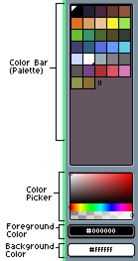
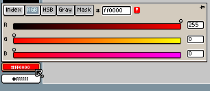
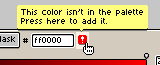

# Color bar

The color bar shows the palette for the active sprite:

Each color can be identified by its index, starting from 0 to 255.

With `Left click` you can select the foreground color, and with `Right click`
the background color. With the `X` key you can swap these colors.

Depending on the active sprite [color mode](color-mode.md):

* On Indexed images, the color bar shows all the available colors to
  be used in the sprite. You cannot use colors that are not present in
  the palette, the only way is modifying the palette itself pressing
  the `Edit Palette` button or `F4` key.

* On RGB images the color bar shows a palette of colors to pick from,
  but the sprite doesn't depend on the palette, you can modify it and
  the sprite will look the same. Even more, you are able to use colors
  inside the sprite that aren't present in the palette.

## Foreground Color

Color used to draw with the `Left click`. If you click the button you
will see a popup window to select colors using
[RGB](http://en.wikipedia.org/wiki/RGB_color_model) or
[HSB](http://en.wikipedia.org/wiki/HSL_and_HSV) sliders:

The little warning icon  can be
pressed to add the color to the palette if it's not present:

## Background Color

Color used to draw with the `Right click`.

Also this color is used to clear the `Background` layer in several situations:

* When the selection is cleared (*Edit > Clear* menu), or
* When a new empty frame is added (*Frame > New Empty Frame* menu)
* When a transparent layer is converted to Background (*Layer > Background from Layer* menu)

---

**SEE ALSO**

[Color](color.md)
