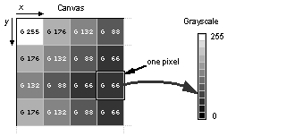

# Color Mode

Aseprite supports three different kinds of color modes:

* RGB
* Indexed
* Grayscale

When you create a [new sprite](new-sprite.md) you have to choose one of these color
modes. In this section you will see the details of each one.

## RGB

RGB, or RGBA, stands for Red-Green-Blue-Alpha. Each image pixel
contains these four components. It means that a pixel is completely
independent from others.

The alpha component specifies how opaque the color is:
`Alpha = 255` means completely opaque, and `Alpha = 0` completely
transparent.

Special note: Background layer doesn't have an alpha component, so
it will always be opaque.

## Indexed

In this mode each pixel has a number that references a palette
color. Your palette can contain up to 256 colors, and each pixel
points to one of those colors (from 0 to 255).

Unlike RGBA, if you modify the palette color, all pixels that are
referencing that color will change their appearance.

An important concept on Indexed images is that for transparent layers,
we need a special index to act as the transparent color.
Generally this index is 0, but you can change it
from *Sprite > Properties* menu.

## Grayscale

It's more like RGBA, just that you have two channels: Value and Alpha.
Here 0 means black and 255 is white. The alpha channel behaves exactly
like it does in RGBA mode.

---

**SEE ALSO**

[Color](color.md) |
[New Sprite](new-sprite.md)
