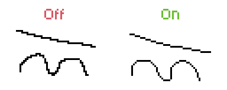
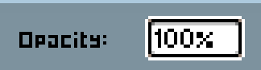
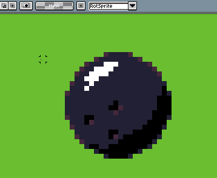
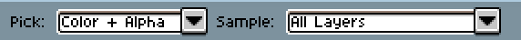
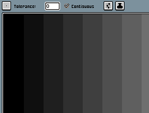
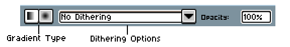
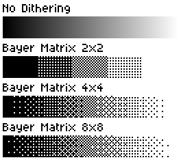
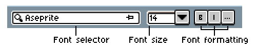

# Context Bar

The context bar shows specific options for the active tool. It also
changes depending on the state of the active document (e.g. when the selection is moved). You can find the context bar directly above the [sprite editor](sprite-editor.md) view:

## Pencil tool & other painting tools

This is the context bar for the Pencil tool:

The context bars for most painting tools look similar to this, with a few options added or removed.

### Brush type, custom brushes, & brush angles

See the [brushes section](brushes.md).

### Brush size 

The brush size (in pixels). To quickly change the size of the brush, you can use <kbd>Ctrl+Alt</kbd> and drag.

### Ink

See the [ink section](ink.md).

### Dynamics

See the [dynamics section](dynamics.md).

### Pixel-perfect mode

Enables/disables pixel-perfect strokes.

### Opacity

While it isn't an option in the pencil tool, you can find the opacity option in some of the other painting tools. This changes the transparency of the tool, with `100%` being fully opaque and `0%` being fully transparent.

## Selection tools

See the [selection section](selecting.md) for selecting and the [rotation section](rotate.md) for rotating and pivot.

### Transparent Color & Transparent Color Options

The Transparent Color option allows you to change the transparent color for the selection.

In the Transparent Color Options, you can change whether the transparent color in the selection is opaque or transparent. Shown above is transparent mode.

## Moving selection

See the [move selection section](move-selection.md).

## Eyedropper tool

See the [eyedropper section](eyedropper.md).

## Paint Bucket

### Tolerance

The paint bucket tolerance adjust if a similar color will be filled, with `0` being only the exact color will be filled and `255` being all colors will be filled. 

### Contiguous mode

Contiguous mode toggles between only selecting connected pixels of the same color or all pixels of the same color. 

### Extra options

|||
|-|-|
|Stop at grid| When in Contiguous mode and when the grid is enabled, stop filling at a grid line. 
||

|||
|-|-|
|Refer active layer| Fills based on the active layer.
|Refer visible layers | Fills based on the visible layers. The filled area is still on the active layer, so the visible layers act as masks.
||

|||
|-|-|
|4-Pixel Connectivity| When in Contiguous mode, don't treat diagonal pixels as connected.
|8-Pixel Connectivity| When in Contiguous mode, treat diagonal pixels as connected.
||

## Gradient tool

The Gradient tool has the same options the Paint Bucket has, along with these extra ones.

### Gradient type

Toggles between a linear and radial gradient.

### Dithering options

- No dithering
- Bayer Matrix 2x2
- Bayer Matrix 4x4
- Bayer Matrix 8x8

## Text tool

### Font selector

Picks the font to use.

### Font size

Changes the font size. Depending on the font, some font sizes may have the `*` symbol next to them, indicating that the size is to pixel scale with the font.

### Font formatting

Changes the font formatting. Options:

- Bold
- Italic

- Antialias - Toggles antialising, which smoothes out the text.
- Hinting - Toggles hinting, which aligns the font to the pixel grid.
- Ligatures - Toggles ligatures.

## Move tool

Selects layers based on which layer the clicked content is on.

## Slice tool

See the [slices section](slices.md).

---

**SEE ALSO**

[Workspace](workspace.md) |
[Drawing](drawing.md) 