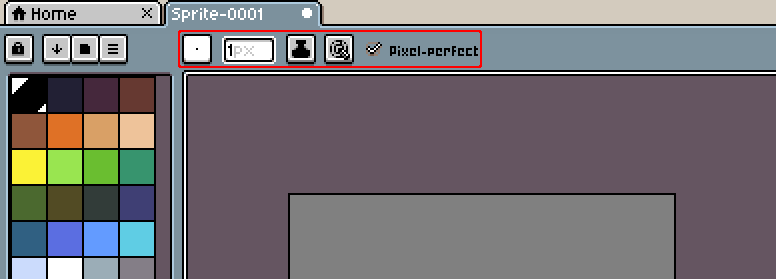
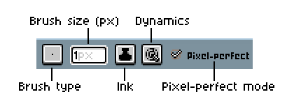
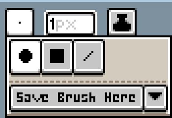
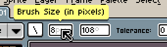
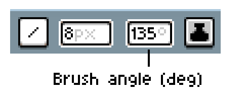
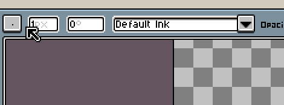
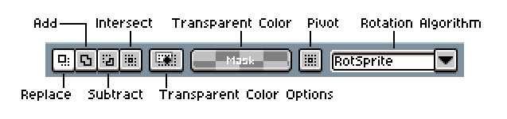
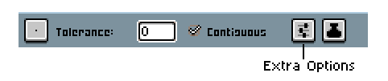

# Context Bar

(*Work-in-progress*)

The context bar shows specific options for the active tool. It also
changes depending on the state of the active document, e.g. when we
move the selection.

## Pencil-like tools

This is the context bar for the Pencil tool:

The first elements are Brush type/shape:

The brush size (in pixels):

And the brush angle:

It's useful for line brush type:

## Selection tools

## Moving selection

(*Work-in-progress*)

## Eyedropper

(*Work-in-progress*)

## Paint Bucket tool

(*Work-in-progress*)

