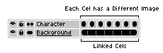

# Continuous Layers

The continuous icon  indicates what kind
of [cels](cel.md) you prefer when they are copied.
It modifies the behavior of certain commands like
[New Frame](new-frame.md),
[Copy Frames](copy-frames.md), or [Copy Cels](copy-cels.md).

There are two possible states:

1.  This layer is a normal layer (with discontinuous cels): new cels will be created unlinked (cels are copied).
1.  This layer is continuous: new cels are created in a [linked way](linked-cels.md).

Generally you will prefer continuous cels for [background layers](layers.md#background-layer) (with static content),
and discontinuous mode in layers that have a different cel on each frame:

This option can be switched depending on the specific situation you
are working on. Modifying the option doesn't change current cels,
so it only affects future operations.

---

**SEE ALSO**

[Linked Cels](linked-cels.md) |
[Layers](layers.md) |
[New Frame](new-frame.md) |
[Copy Frames](copy-frames.md) |
[Timeline](timeline.md)
