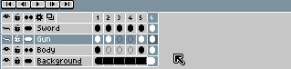

# Copy Cels

Use the [timeline](timeline.md) to copy cels:

1. Select a range of cels you want to copy.
2. Move the mouse to the selection border.
3. Hold <kbd>Ctrl</kbd> or <kbd>Alt</kbd> key and start dragging.
4. Drop the copy where you want, holding <kbd>Ctrl</kbd> or <kbd>Alt</kbd> keys.

Note that you can copy cels beyond the end of the animation. In this
case new empty frames are created automatically.

When copying cels on a [continuous layer](continuous-layers.md), copied cels will be [linked](linked-cels.md) to the original ones.

---

**SEE ALSO**

[Move Cels](move-cels.md) |
[Copy Frames](copy-frames.md) |
[Timeline](timeline.md)
