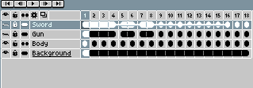

# Copy Layers

Use the [timeline](timeline.md) to copy layers:

1. Select a range of layers you want to copy.
2. Move the mouse to the selection border.
3. Hold `Ctrl` or `Alt` key and start dragging.
4. Drop the copy where you want, holding `Ctrl` or `Alt` keys.

---

**SEE ALSO**

[Move Layers](move-layers.md) |
[Timeline](timeline.md)
