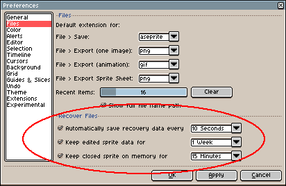
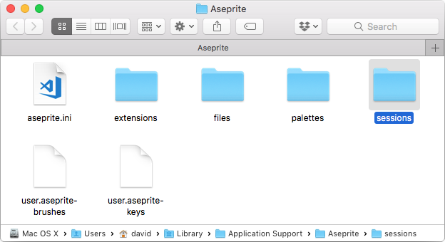
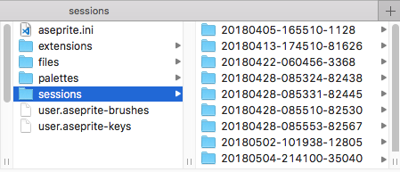

# Data Recovery

When Aseprite is running, it saves some temporary data to restore your
sprite in case that your computer (or Aseprite) crashes, or you close
Aseprite without saving your sprites. (Even if you save your sprites,
the original backup is kept in your disk at least for a couple of
weeks.)

## Open Sprites from Previous Sessions

To restore a sprite from previous sessions you have to use the
"Recover Files" option in the "Home" tab:

If Aseprite crashes (wasn't closed correctly) and some sprite wasn't
saved, you will see the "Recover Files" option as a button:

This option opens the "Recover Files" tab, where you can double-click
an item (or select it and press "Recover Sprite") to recover a sprite
from previous sessions:

## Preferences

In the *Edit > Preferences > Files* section you can configure how the
backup data is saved and for how long:

* *Automatically save recovery data every X seconds/minutes*:
  Indicates that Aseprite should auto-save backup data (on disk) every
  X seconds or minutes for each edited sprite (2 minutes by default).
* *Keep edited sprite data for Y days/weeks/months*: For each sprite
  that was edited, Aseprite will keep the backup data (on disk) for
  the given number of days/weeks/months (1 week by default).
* *Keep closed sprite in memory for Z seconds/minutes/hours*: If you
  close a sprite by mistake, Aseprite will keep the sprite (in memory,
  with the undo information) for at least the given time (15 minutes
  by default). You can re-open a closed file
  with *File > Open Recent > Reopen Closed File* menu
  option (Ctrl+Shift+T or ⇧⌘T keyboard shortcut).

## Internals

The backup data is saved in a subfolder named `sessions` inside your
[Preferences Folder](preferences-folder.md):

`sessions` might contain several subfolders (one for each execution of Aseprite):

The name of these folders (e.g. `20180405-165510-1128`) has a meaning,
which is `YYYYMMDD-HHMMSS-PID`:

* `YYYY`, `MM`, `DD`: Date (year, month, day) when the session
  started (when Aseprite was launched).
* `HH`, `MM`, `SS`: Time (hour, minute, second) of that day when the session started.
* `PID`: Process number/identifier of the Aseprite instance that was
  handling that session folder.

Each of these folders contain useful data to restore some sprites that
you might have lost in the crash.

If you aren't able to recover your sessions using the "Recover Files"
option from "Home" tab, but you have one of these
`sessions/YYYYMMDD-HHMMSS-PID` folder in your [Preferences Folder](preferences-folder.md),
you can compress one of those folders into a `.zip` and send it to
[support@aseprite.org](mailto:support@aseprite.org), and we can
try to recover your data.

---

**SEE ALSO**

[Troubleshooting](troubleshooting.md) |
[Preferences Folder](preferences-folder.md) |
[Blog Article About Data Recovery Internals](https://dev.aseprite.org/2015/06/14/data-recovery/)
