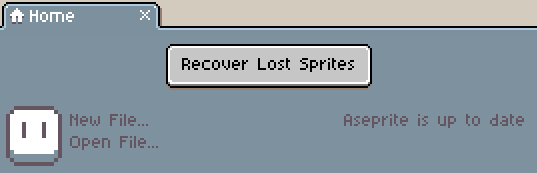

# Data Recovery

When Aseprite is running, it saves some temporary data to restore your
sprite in case that your computer (or Aseprite itself) crashes.
This temporary data is saved in a subfolder named `sessions` inside your
[Preferences Folder](preferences-folder.md):

> 

In `sessions` might be several subfolders:

> 

The name of these folders (e.g. `20180405-165510-1128`) has a meaning,
which is `YYYYMMDD-HHMMSS-PID`:

* `YYYY`, `MM`, `DD`: Date (year, month, day) when the session
  started (when Aseprite was launched).
* `HH`, `MM`, `SS`: Time (hour, minute, second) of that day when the session started.
* `PID`: Process number/identifier of the Aseprite instance that was
  handling that session folder.

Each of these folders contain useful data to restore some sprites that
you might have lost in the crash. When you start Aseprite again, you
may see this button to recover those sprites:

> 

If you don't see the *"Recover Lost Sprites"* button when you launch
Aseprite, but you have one of these `sessions/YYYYMMDD-HHMMSS-PID`
folder in your [Preferences Folder](preferences-folder.md), you can
compress one of those folder in a `.zip` and send it to
[support@aseprite.org](mailto:support@aseprite.org). We can
try to recover your data.

---

**SEE ALSO**

[Troubleshooting](troubleshooting.md) |
[Preferences Folder](preferences-folder.md) |
[Blog Article About Data Recovery Internals](https://dev.aseprite.org/2015/06/14/data-recovery/)
