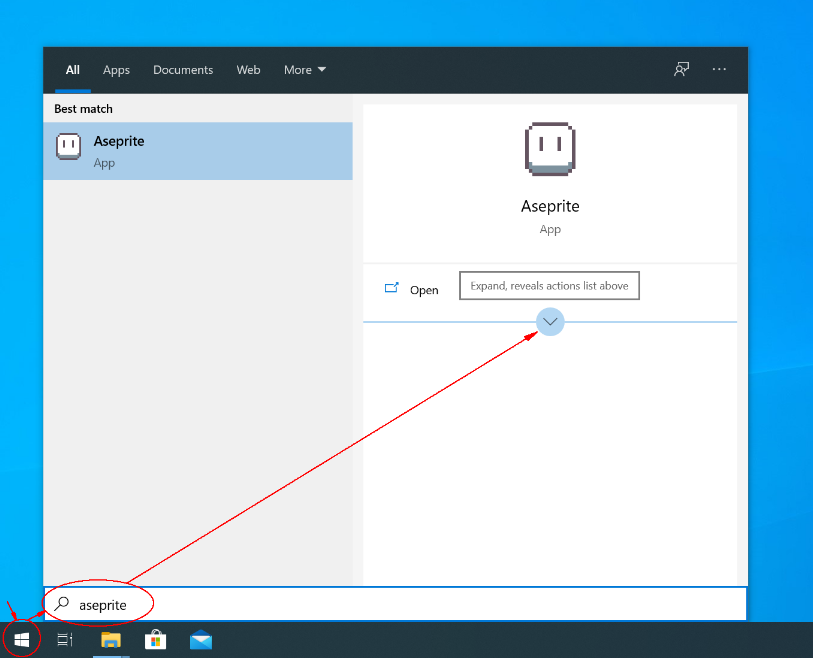
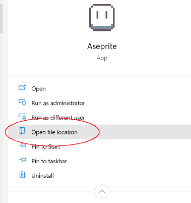
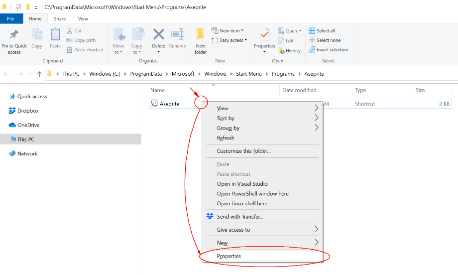
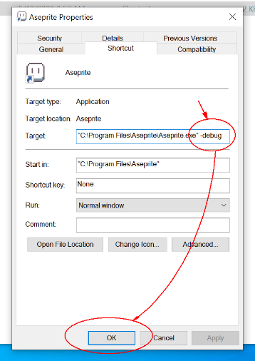
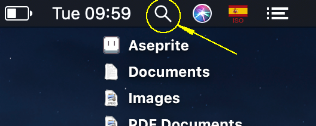
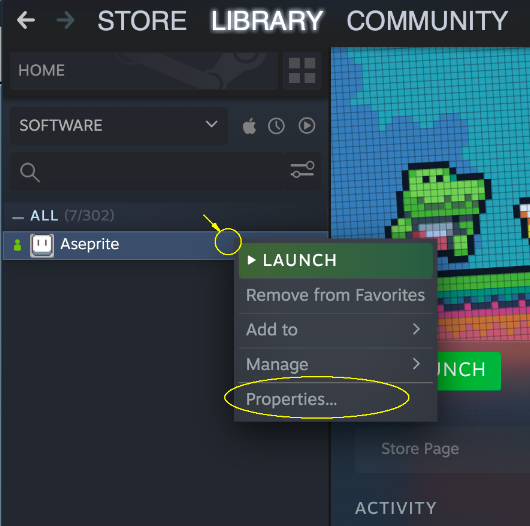
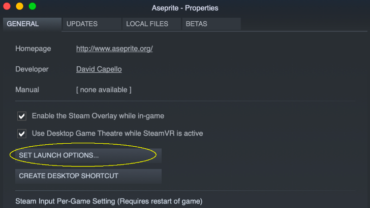
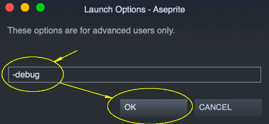

# Debug

In case that you are having some problem running Aseprite, you can
execute it with the `-debug` option in the command line.

After running Aseprite, you will see that a
`Aseprite-v1.2-DebugOutput.txt` file (or with a similar name) will
be created in your desktop.  You can send us that file at
[support@aseprite.org](mailto:support@aseprite.org) so we can help us
solving your specific problem.

How to add the `-debug` parameter on:

* [Windows](#windows)
* [macOS](#macos)
* [Steam](#steam)

## Windows

1. You can press the Windows key to open the Start menu and write
   `Aseprite`, then expand the actions of Aseprite:

   

2. In the actions list click "Open file location":

   

3. Right-click the Aseprite shortcut and select the "Properties" option:

   

4. Finally write the `-debug` parameter in "Target" box and press "OK":

   

## macOS

1. First you have to close Aseprite, then open the Spotlight Search
   pressing ⌘Space or clicking the magnifying glass in the menu bar:

   

2. In the Spotlight Search write `Terminal` and Enter key to open the
   Terminal app:

   

3. In the terminal write the following command and press Enter:

       open -a Aseprite --args -debug

## Steam

On Steam you can add the `-debug` option in the Aseprite launch options:

1. Right-click Aseprite (or Ctrl+click on macOS) in your Steam library
   and open its "Properties":

   

2. Click the "Set Launch Options" button:

   

3. Add the `-debug` option and press "OK":

   

---

**SEE ALSO**

[Troubleshooting](troubleshooting.md)
