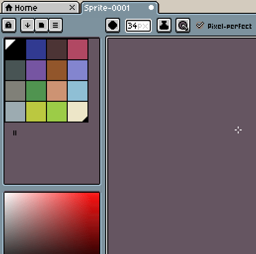

# Default Palette

New sprites are created with the default palette. This default palette is [Richard
"DawnBringer" Fhager 32 colors palette](http://pixeljoint.com/forum/forum_posts.asp?TID=16247)
initially.

Anyway you can change it using the ☰ *> Save Palette as Default* menu option:

---

**SEE ALSO**

[New Sprite](new-sprite.md)
