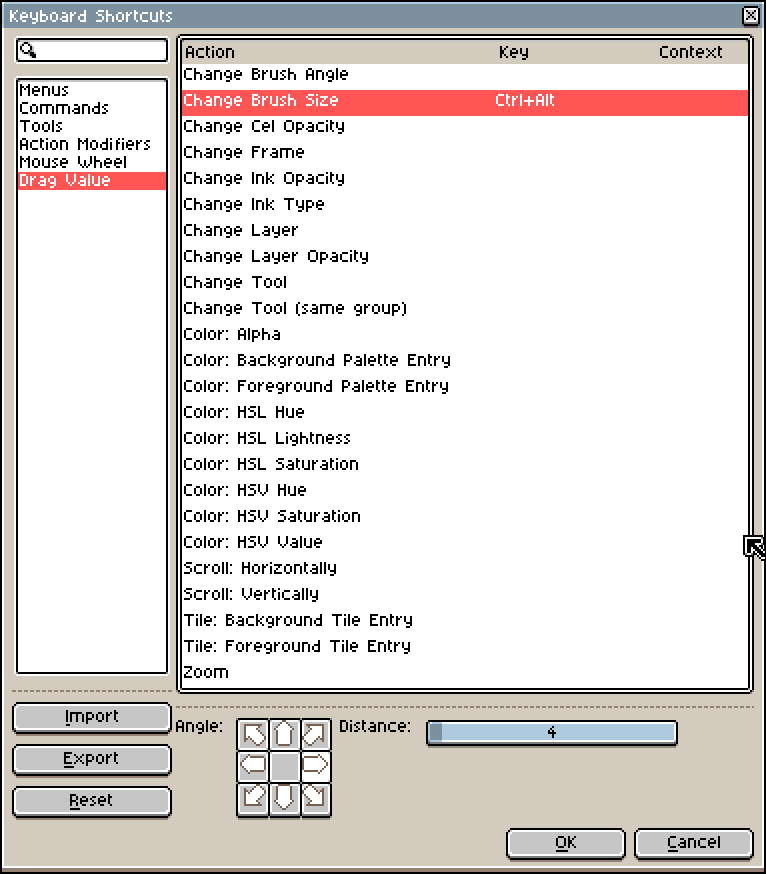
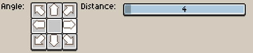

# Drag Value

Since **v1.3-beta12**, from *Edit > Keyboard Shortcuts > Drag Value*,
you can configure a key to be pressed and move/drag the mouse in a
specific direction (e.g. left/right or up/down) to change a specific
value/parameter inside Aseprite until you release the key.

By default, <kbd>Ctrl+Alt</kbd> is configured in such a way to
increase/decrease the Brush Size moving the mouse from left to
right/right to left:

The controls at the bottom indicates the direction of the increment
(right) and the distance of pixels (4) that the mouse must travel to
increment one unit (in this case one unit of the Brush Size).

---

**SEE ALSO**

[Mouse Wheel](mouse-wheel.md) |
[Keyboard Shortcuts](keyboard-shortcuts.md) |
[Issue #3195](https://github.com/aseprite/aseprite/issues/3195)
