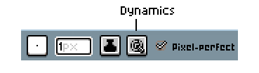
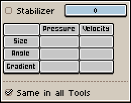
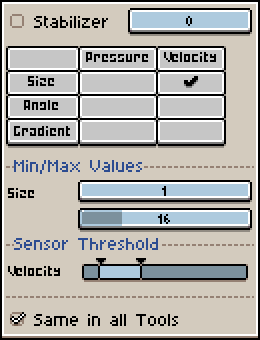
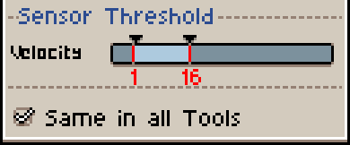

# Dynamics

The brush dynamics menu can dynamically change the size, shape, or gradient of a brush stroke. It is most useful when using Aseprite with a pen, but you can also use it with a mouse. 

When using any painting tool, you can access the dynamics menu in the [context bar](context-bar.md). 

Once opened, the menu looks like this:

The left column (Pressure) is for use with a pen, and the right (Velocity) is for use with a mouse. 

Only one of these can be selected per row. You can have multiple rows selected at once.

## Sensor Thresholds

The sensor threshold controls what an amount of pressure/velocity does to the stroke. 

Moving the handles to the right makes the smallest amount of pressure/velocity required greater, making the stroke less sensitive. Moving the handles to the left makes the smallest amount of pressure/velocity required smaller, making the stroke more sensitive. 

The spacing between the handles also affects sensitivity, with the handles being closer making the stroke more sensitive, and the handles being farther making the stroke less sensitive.

## Min/Max values

The minimum and maximum setting values set the bounds of the sensor threshold. For example, if the size setting was selected, and the min was `1` and the max was `16`, then the lowest amount of pressure/velocity would change the size to `1`, the highest to `16`, and any amount of pressure/velocity in between the highest and lowest would change the size to somewhere between `1` and `16`.

## Stabilizer

The stabilizer toggle helps stabilize the stroke by drawing it a certain number of pixels away from the cursor.

----

**SEE ALSO**

[Context Bar](context-bar.md) |
[Brushes](brushes.md) 

