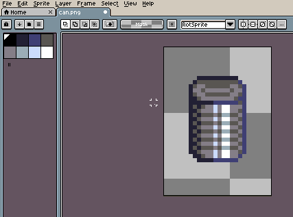
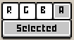

# Edit Menu

The **Edit Menu** contains options/commands to modify the current sprite, as well as Aseprite settings.

## Undo, Redo, & Undo History

* **Undo**: Undoes the previous action.
* **Redo**: Redoes the previous action.
* **Undo History**: See the [Undo History](undo-history.md#undohistory) section. 

## Cut, Copy, & Paste

* **Cut**: Cuts the active [selection](selecting.md#selecting) content.
* **Copy**: Copies the selected content, [layer](layers.md#layers), [cel](cel.md#cel), or frame; e.g if a layer was selected, the layer would be copied.
* **Copy Merged**: Copies the selected content for each visible layer, merged into one image.
* **Paste Special**: 
    * *Paste as New Sprite*: Pastes as a new [sprite](sprite.md#spritestructure).
    * *Paste as New Layer*: Pastes as a new layer.
    * *Paste as New Reference Layer*: Pastes as a new [reference layer](reference-layer.md#referencelayer).
* **Delete**: Deletes the selected content, layer, cel, or frame.

## Fill & Stroke

* **Fill**: Fills the active selection with the [foreground color](color-bar.md#foreground-color).
* **Stroke**: Outlines the inside of the active selection with the foreground color.

## Rotation & Flipping

* **Rotate**: See the [Rotate Canvas](rotate-canvas.md#rotate-canvas) section. 
* **Flip Horizontal/Vertical**: See the [Flip Canvas](flip-canvas.md#flip-canvas) section. 
* **Transform**: Selects the cel content.
* **Shift**: Shifts the pixels of a selection once in the selected direction. Pixels on the ends of the selection will wrap around when shifted.

## New Brush & New Sprite From Selection

* **New Brush**: Creates a new brush. See the [Brushes](brushes.md#custom-pattern-brushes) section.
* **New Sprite From Selection**: Creates a new sprite from the selection content. See the [New Sprite](new-sprite.md#new-sprite-from-selection) section.

## Replace Color

See the [Replace Color](replace-color.md#replace-color) section. 

## Invert

Inverts all of the colors in a selection or cel.

The menu has a few important buttons at the bottom:

* The *R*, *G*, *B*, and *A* buttons control if a component should be inverted, e.g: the *R* button is checked, so the *R* (red) component can be inverted.
* The bottom button controls if the invert should apply to the active timeline selection (*Selected*) or all of the cels in the sprite (*All*). If [a portion of a sprite is selected](selecting.md#selecting): in *Selected* mode the invert would only apply to the selected content of the selected timeline elements; in *All* mode the invert would apply to the selected content of all of the sprite's cels.

## Adjustments

See the [Adjustments](adjustments.md#adjustments) section. 

## FX

See the [FX](fx.md#fx) section. 

## Insert Text

See the [Text Tool](text-tool.md#text-tool-&amp;-insert-text) section. 

## Keyboard Shortcuts

See the [Keyboard Shortcuts](keyboard-shortcuts.md#keyboard-shortcuts) section. 

## Preferences

See the [Preferences](preferences.md#preferences) section. 

---

**SEE ALSO**

[Menu Bar](menu-bar.md#menu-bar)