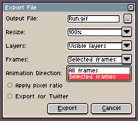
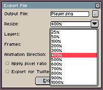
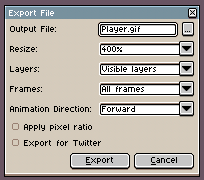

# Exporting

Generally you will use *File > Save* to [save your work](save.md) with full
information [as an `.aseprite` file](files.md#aseprite). Then you can export
your sprite for your own game, website, application, etc. using the *File > Export > Export As*
menu option (<kbd>Ctrl+Alt+Shift+S</kbd> key or <kbd>⌥⇧⌘S</kbd> on macOS)
to convert your sprite into a `.gif` file or a sequence of `.png` files.

*File > Export > Export As* will remember the latest options you've used in case
that you want to save the copy again.

## Export as a sequence of images

You can save the whole animation as a sequence specifying a file name
with a number and a file type for static images. E.g. `frame1.png`
where `1` specifies the number of the first frame, and `.png` the
static file type used to save each frame. See how to
[load a sequence of images](open.md#loading-image-sequences).

If you specify other file name like `frame001.png` file names will be
like `frame001.png`, `frame002.png`, `frame003.png`, etc.

## Export Just One Frame

From *File > Export* you can export one frame (or one layer, or a set of selected frames, etc.)
changing *Frames* field to *Selected frames*:

## Automatic Resize on Export

The *File > Export* dialog contains a special *Resize* field so you
can save your copy with other scale. E.g. It's useful to upload your
animation for social networks (like Twitter), that needs higher scales
(e.g. 400% of your original sprite size):

## Other Export Options

There are other useful options in *File > Export*:

* *Animation Direction*: You can export your animation in Forward,
  Backward, or Ping-Pong mode.
* *Apply pixel ratio*: In case your sprite has a special pixel aspect
  ratio (like 2:1), checking this option will export the sprite
  applying the pixel aspect ratio to the final result.
* *Export for Twitter*: Adjusts the animation to avoid some problems
  on Twitter reproducing the last frame with an invalid delay.

---

**SEE ALSO**

[Save](save.md) |
[Sprite sheets](sprite-sheet.md) |
[Command Line Interface](cli.md)
