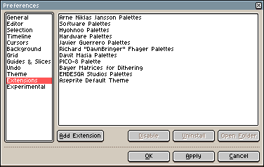

# Extensions

Since **[Aseprite v1.2-beta10](https://www.aseprite.org/release-notes/#aseprite-v1-2-beta10)**
you can add/remove extensions to/from Aseprite. Extensions are
distributed as `.aseprite-extension` (`.zip`) files and you can
manage them from *Edit > Preferences > Extensions*:

## Add/Remove Extensions

In *Edit > Preferences > Extensions* there is a "Add Extension"
button. You can use it to select a `.aseprite-extension` or `.zip`
file.  After installing the extension it will be uncompressed in your
[configuration directory](preferences-folder.md) inside the
`extensions` subfolder.

## File Content

An extension/plugin is exactly the same as a `.zip` file but you can
rename the file extension to `.aseprite-extension` so the user can
double-click it in Windows Explorer or macOS Finder.

The content of the `.zip` file varies depending on the kind of
extension that you want to create, but at least they must contain one
file inside: the `package.json` file.

The structure of a `.aseprite-extension` file depends on the kind of extension:

* [Keys](extensions/keys.md)
* [Palettes](extensions/palettes.md)
* [Languages](extensions/languages.md)
* [Themes](extensions/themes.md)
* [Dithering Matrices](extensions/dithering-matrices.md)
* [Plugins with Scripts](https://github.com/aseprite/api/blob/master/api/plugin.md#plugin)
