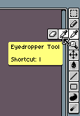
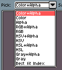
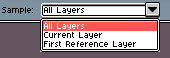

# Eyedropper

The Eyedropper tool 
is useful to pick colors from the image itself. It can be activated
moving the mouse on the Eraser icon in the toolbar:

Alternatively you can activate it pressing the `I` key or `Alt+click`.
Using `Left click` will pick the color and store it as the
[Foreground color](color-bar.md#foreground-color), using
the `Right click` it will be stored as
the [Background color](color-bar.md#background-color).

You have some extra options in the [context bar](context-bar.md):

* Options to pick HSV or HSL values instead of RGB values:

  

* Pick colors from the *All Layers* (the composition of layers), the
  *Current Layer* only without composition (ignoring the layer
  blending modes), or *First Reference Layer* to pick colors from the
  first reference layer that is found.

  

## Pick colors with right click

You can configure the `Right click` to pick colors from
[Edit > Preferences > Editor](right-click.md).

---

**SEE ALSO**

[Color bar](color-bar.md) |
[Right-click](right-click.md)
