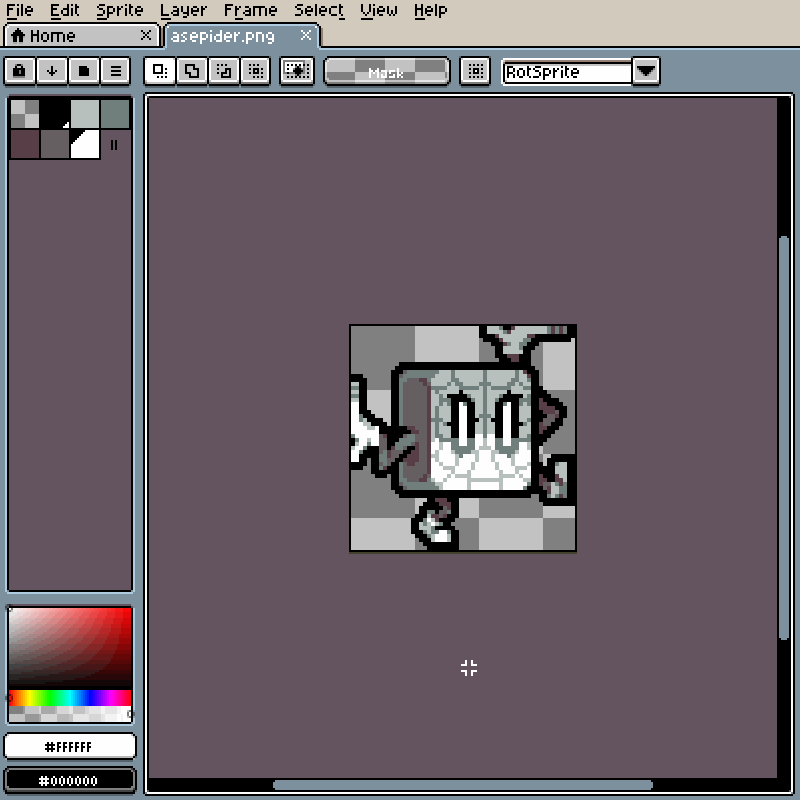

# Flip Sprite or Selection

<!-- PREVIEW: GIF, flipping a sprite, then a selection -->

## Flip Horizontal

To flip the sprite or selection horizontally, you can select *Edit > Flip Horizontal* menu (<kbd>Shift+H</kbd>).

## Flip Vertical

To flip the sprite or selection vertically, you can select *Edit > Flip Vertical* menu (<kbd>Shift+V</kbd>).
