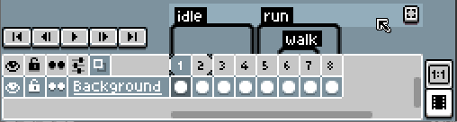
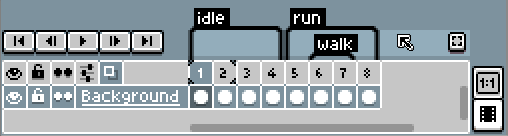

# Focus Tag

The [timeline](timeline.md) has the possibility to focus
[a tag](tags.md), actually a *"tag band."* We define a
*"tag band"* as these rows where several tags are grouped:

You can double-click one of these bands or press the little button at
the right side to "focus" the tags in this band (and hide all others):

When you do this, the Play button 
will reproduce only tags found in the currently focused band.

---

**SEE ALSO**

[Tags](tags.md) |
[Timeline](timeline.md) |
[Animation](animation.md)
