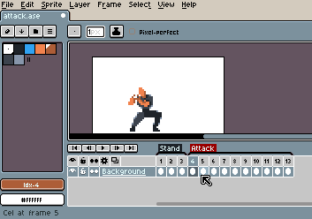

# Frame Duration

You can change the duration of the current frame with *Frame > Frame
Properties* menu (<kbd>P</kbd> key).

Also you change the duration of several frames selecting a range of
frames in the [Timeline](timeline.md), right clicking them, and
selecting *Properties* option in the popup:

---

**SEE ALSO**

[Animation](animation.md)
