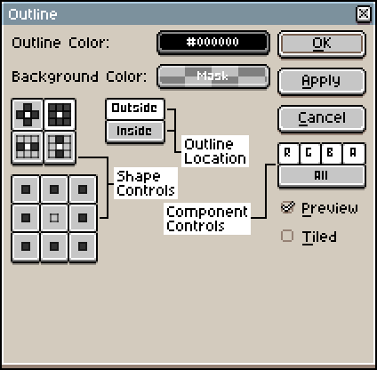
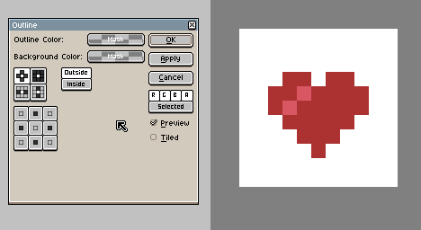
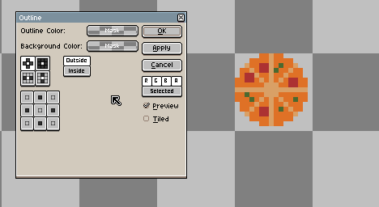
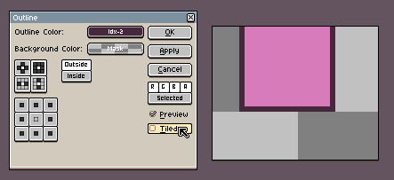
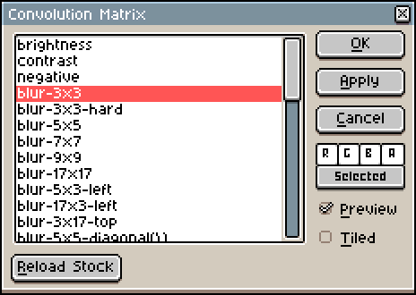
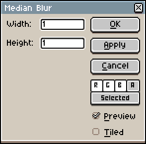

# FX

The FX (effects) dropdown can be accessed with *Edit > FX*, and it contains various effects to use on the sprite.

## Outline

The outline menu adds an outline around the sprite or the selected content. The algorithm outlines any shape that is not the *Background Color*. *Shortcut:* <kbd>Shift+O</kbd>.

* **Outline Color**: Sets the color of the outline.
* **Background Color**: Sets the background color for the outline algorithm to detect. The algorithm outlines any shape that is not the *Background Color*.

    

* **Outline Location**: Can either be *Inside* or *Outside*. *Inside* draws the outline inside the shape and *Outside* draws the outline outside the shape.

    

* **Shape Controls**: Controls the outline shape. The lower button panel can be used to create custom shapes, while the upper button panel are presets.
* **Component Controls**: 
    * The *RGBA* buttons control which components of the outline color are used, e.g: if the *R* component is not selected the outline color will have an Red rgb value of `0`. By default, all components are selected.
    * The bottom button controls if the outline should apply to the active timeline selection (*Selected*) or all of the cels in the sprite (*All*). If [a portion of a sprite is selected](selecting.md#selecting): in *Selected* mode it would only apply to the selected content of the selected timeline elements; in *All* mode it would apply to the selected content of all of the sprite's cels. 
* **Tiled**: When enabled, if a shape is cut off by the edge of the canvas, the cut off outline wraps around to the opposite side.

     

## Convolution Matrix

A list of [convolution matrix](https://en.wikipedia.org/wiki/Kernel_(image_processing)) filters/effects to apply to the sprite or the selected content. *Shortcut:* <kbd>F9</kbd>.

## Despeckle

Applies a [median filter](https://en.wikipedia.org/wiki/Median_filter) to the sprite or the selected content.

---

**SEE ALSO**

[Adjustments](adjustments.md#adjustments) |
[Edit Menu](edit-menu.md#edit-menu)
