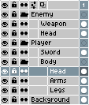

# Layer Group

To better organize your sprite, you can group a set of layers in a little folder:

With groups you can show/hide (<kbd>Shift+X</kbd>) or lock/unlock
several layers at the same time, or expand/collapse the folder
in the [timeline](timeline.md) (<kbd>Shift+E</kbd>)

To create a new *Layer Group* you can use the *Layer > New > New
Group* menu, or pressing <kbd>Alt+Shift+N</kbd> shortcut. If there is
a [selected range of layers](range.md) in the [timeline](timeline.md),
the new group will be created containing those selected layers
automatically.

---

**SEE ALSO**

[Layers](layers.md) |
[Timeline](timeline.md)
