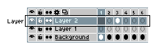
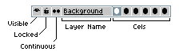

# Layers

One sprite can be subdivided into several layers. You can see them
in the [timeline](timeline.md):

Each layer has several options:

*Layer Name*: Text to identify this layer.  You can change the layer
name by double-clicking the layer, or from the *Layer > Properties* menu (<kbd>Shift+P</kbd> key).

*Cels*: A set of [cels](cel.md), frames that contain something
visible for this specific layer in the specific frame.

*Visible*: It indicates if the layer is visible 
or hidden . You can switch the layer visibility
using *Layer > Visible* menu or <kbd>Shift+X</kbd> key.

*Locked*: If the layer is locked , you cannot draw on it.
By default all layers are unlocked/editable .

*Continuous*: This option is used to indicate what kind
of [cels](cel.md) you prefer when they are created for this
specific layer. See the [Continuous Layers](continuous-layers.md)
section for more information.

### Common Operations

* [Add new layer](new-layer.md)
* [Move layers](move-layers.md)
* [Copy layers](copy-layers.md)

## Background Layer

The background layer is an opaque layer (without alpha/transparent
component) that cannot be moved. It's created by default when you
select an opaque color in the *File > New* window, or when you open a
file (e.g. a `.png` file) that doesn't contain the alpha component.

A sprite can contain only one background layer and it's always at the
bottom of the layers stack in the [timeline](timeline.md).

When you select a portion of the background layer and clear it (using
*Edit > Clear* menu), the selection will be cleared with the active
[background color](color-bar.md).

## Transparent Layers

All layers with an alpha channel are called transparent layers.
You can have several of these in the same sprite.
You can stack them as you want using the [timeline](timeline.md).
And you can displace these layers using the [Move tool](move-tool.md) ).

When you select a portion of a transparent layer and clear it (using
*Edit > Clear* menu), the selection will be cleared with
[transparent color](transparent-color.md).

You can use *Layer > New > New Layer* menu or <kbd>Shift+N</kbd> to
create a new transparent layer.

## Background from Layer

If there is no background layer, you can convert any transparent
layer to the background using the *Layer > Convert To > Background*
menu. All transparent pixels will be filled with the active
[background color](color-bar.md#background-color).

> Previously, on Aseprite v1.2 the option was *Layer > Background from Layer*

## Layer from Background

If you want to convert the background to a transparent layer
(e.g. because you want to move it with the [Move tool](move-tool.md)
), you can use the
*Layer > Convert To > Layer* menu.

> Previously, on Aseprite v1.2 the option was *Layer > Layer from Background*

## Layer Group

You can [group layers](layer-group.md) to handle a set of layers as
one unit.

## Tilemap Layer

Since **Aseprite v1.3**, you can create [tilemap layers](tilemap.md)
from *Layer > New > New Tilemap Layer* menu or using <kbd>Space+N</kbd>.
You can also use *Layer > Convert To > Tilemap* from any regular transparent
layer (the tiles will be created from the active grid settings).

## New Layers from Selection

* <kbd>Ctrl+J</kbd> or <kbd>⌘J</kbd>: Copies the [selection](selecting.md) and creates a new layer from it
* <kbd>Ctrl+Shift+J</kbd> or <kbd>⇧⌘J</kbd>: Cuts the [selection](selecting.md) and creates a new layer from it

---

**SEE ALSO**

[Timeline](timeline.md) |
[Continuous Layers](continuous-layers.md) |
[Move tool](move-tool.md)
