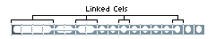
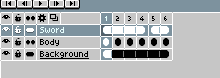

# Linked Cels

Two cels are linked when they share their image and the *xy*-coordinate.
Linked cels looks as follow in the [timeline](timeline.md):

When you modify one of these cels, all linked cels are modified. In
this way you can propagate the same change into several
frames. E.g. If you have a static background, you would prefer linked
cels, so you can make changes just in one cel to view the change in
the whole animation.

To create linked cels you have to
[copy cels](copy-cels.md)
in a [continuous layer](continuous-layers.md)
(i.e. a layer with the Continuous icon ).

## Unlink Cels

There is a way to unlink cels using right-click and *Unlink* option in
the timeline:

Unlinked cels will contain their own copy of the image. So now if you
modify them the change will not be propagated to other cels.

---

**SEE ALSO**

[Continuous Layers](continuous-layers.md)
