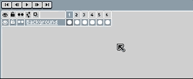

# Loop

## Set loop section

After selecting a range of frames in the [timeline](timeline.md),
you can use the *View > Set Loop Section* menu (<kbd>F2</kbd> key) to set the
animation loop section:

The loop section is just like a regular [tag](tags.md) named "Loop."

---

**SEE ALSO**

[Tags](tags.md)
