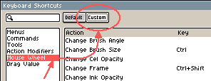

# Mouse Wheel

The default mouse wheel behavior depends
on the [*Edit > Preferences > Editor > Zoom with scroll wheel*](preferences.md#editor) option.
Some of this behavior will change in a near future: [Issue #2896](https://github.com/aseprite/aseprite/issues/2896)

As reference and only in this section, the following symbols have the given meaning:

<kbd>⬆</kbd>: the mouse wheel is moved up  
<kbd>⬇</kbd>: the mouse wheel is moved down

## With *Zoom with scroll wheel*

| Action              | Windows            | macOS              |
|---------------------|--------------------|--------------------|
| Horz. Scroll Left   | <kbd>Shift+⬆</kbd> | <kbd>Shift+⬇</kbd> |
| Horz. Scroll Right  | <kbd>Shift+⬇</kbd> | <kbd>Shift+⬆</kbd> |
| Zoom In             | <kbd>⬆</kbd>       | <kbd>⬇</kbd>       |
| Zoom Out            | <kbd>⬇</kbd>       | <kbd>⬆</kbd>       |
| Increase Brush Size | <kbd>Ctrl+⬇</kbd>  | <kbd>Ctrl+⬆</kbd>  |
| Decrease Brush Size | <kbd>Ctrl+⬆</kbd>  | <kbd>Ctrl+⬇</kbd>  |

## Without *Zoom with scroll wheel*

| Action             | Windows            | macOS              |
|--------------------|--------------------|--------------------|
| Scroll Up          | <kbd>⬆</kbd>       | <kbd>⬇</kbd>       |
| Scroll Down        | <kbd>⬇</kbd>       | <kbd>⬆</kbd>       |
| Horz. Scroll Left  | <kbd>Shift+⬆</kbd> | <kbd>Shift+⬇</kbd> |
| Horz. Scroll Right | <kbd>Shift+⬇</kbd> | <kbd>Shift+⬆</kbd> |
| Zoom In            | <kbd>Ctrl+⬆</kbd>  | <kbd>Ctrl+⬇</kbd>  |
| Zoom Out           | <kbd>Ctrl+⬇</kbd>  | <kbd>Ctrl+⬆</kbd>  |

## Customization

From *Edit > Keyboard Shortcuts > Mouse Wheel* you can
configure the mouse wheel behavior when some extra key is pressed:

---

**SEE ALSO**

[Drag Value](drag-value.md) |
[Keyboard Shortcuts](keyboard-shortcuts.md) |
[Issue #2896](https://github.com/aseprite/aseprite/issues/2896)
