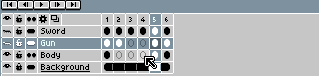

# Move Cels

Use the [timeline](timeline.md) to move cels:

1. Select a range of cels you want to move.
2. Put the mouse above the selection border.
3. Start dragging the from selection border.
4. Drop the cels where you want.

Note that you can move cels beyond the end of the animation. In this
case new empty frames are created automatically.

## Canvas Position

You can move the cel canvas position (*x* and *y* coordinates) using
the [Move tool](move-tool.md) .

---

**SEE ALSO**

[Copy Cels](copy-cels.md) |
[Move Frames](move-frames.md) |
[Move Tool](move-tool.md) |
[Timeline](timeline.md)
