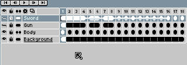

# Move Layers

Use the [timeline](timeline.md) to move layers:

1. Select a range of layers you want to move.
2. Put the mouse above the selection border.
3. Start dragging the from selection border.
4. Drop the layers where you want.

---

**SEE ALSO**

[Copy Layers](copy-layers.md) |
[Timeline](timeline.md)
