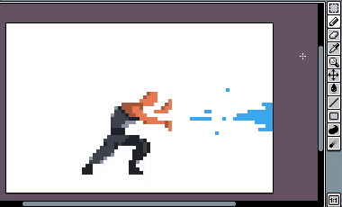

# Move Selection

After [selecting](selecting.md) a part of the [active cel](cel.md),
you can move the selected area of pixels dragging-and-dropping with
the mouse or using the arrow keys:

If you are moving a region of pixels from the
[background layer](layers.md#background-layer) the selection will be
cleared with the active
[background color](color-bar.md#background-color). If you move a
transparent layer, the region will be cleared with the transparent
color.
