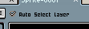
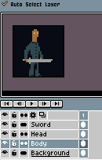
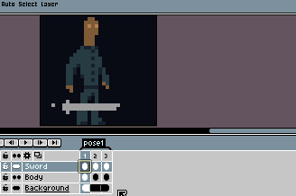

# Move Tool

You can select the Move tool 
with <kbd>V</kbd> key or using <kbd>Ctrl</kbd> key (or <kbd>⌘</kbd> on macOS).

This tool is useful to move the *xy*-position of a [cel](cel.md).

Notes:

* You cannot move the Background layer.
* Use <kbd>Shift</kbd> (<kbd>⇧</kbd>) key to lock x- or y-axis.

## Select and Move Layers

When you use <kbd>Ctrl</kbd> (or <kbd>⌘</kbd>) key and <kbd>Left click</kbd>, the Move tool is
selected with the *Auto Select Layer* option checked:

This option allows you to select and move layers in a quickly way:

## Move Multiple Cels

You can move several cels at the same time using the timeline and the
sprite editor together:

1. Select multiple cels in the timeline, and then
2. Move the cel in the sprite editor.

