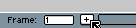

# New Frame

You can add frames using:

* *Frame > New Frame* (<kbd>Alt+N</kbd>): Creates a copy of the current frame in
   the next position.
* *Frame > New Empty Frame* (<kbd>Alt+B</kbd>): Creates a new empty frame. (All
   [transparent layers](layers.md#transparent-layers) with an empty
   cel, and the [Background layer](layers.md#background-layer) is
   cleared with the active background color.)
* *Frame > Duplicated Cels* (<kbd>Alt+D</kbd>): Copies the current cel, or
   creates a copy of the current Timeline selection, into the next
   position/frame.
* *Frame > Duplicated Linked Cels* (<kbd>Alt+Shift+D</kbd> or <kbd>Alt+M</kbd>): Creates
  links to the current cel (or the current Timeline selection) into
  the next position/frame.

The little `+` in the status bar can be used to add new frames (it's like pressing <kbd>Alt+N</kbd>):

## New Frame

Using *View > New Frame* (<kbd>Alt+N</kbd> key) you can create a new frame that
is an exact copy of the current one. For [continuous layers](continuous-layers.md)
cels will be [linked](linked-cels.md)

## New Empty Frame

When a new empty frame is added with <kbd>Alt+B</kbd>, all
[transparent layers](layers.md#transparent-layers) will not
contain cels, and the [background layer](layers.md#background-layer)
will be cleared with the [background color](color-bar.md#background-color).

Empty frames are also created when you [move](move-cels.md) or
[copy cels](copy-cels.md) beyond the end of the animation.

## Duplicated Cels

Some information: https://community.aseprite.org/t/913
