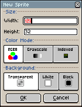
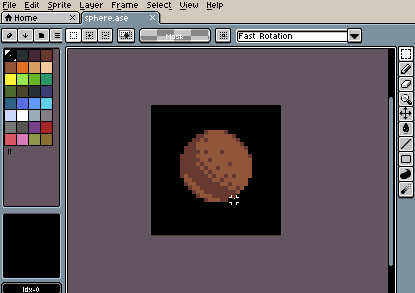

# New Sprite

You can create a new sprite from *File > New* menu (<kbd>Ctrl+N</kbd> or <kbd>⌘N</kbd>).

Here you select the sprite:

* dimension (in pixels),
* its [color mode](color-mode.md), and
* the default background color.

The sprite is created with a specific [palette by default](default-palette.md).

### Math in Numeric Fields

[Numeric fields](numeric-field.md) like *Width* and *Height* can evaluate little math expressions:

## New Sprite from Selection

You can create a new sprite from the active selection using
*Edit > New Sprite from Selection* (<kbd>Ctrl+Alt+N</kbd> or <kbd>⌥⌘N</kbd>):

---

**SEE ALSO**

[Color Mode](color-mode.md) |
[Default Palette](default-palette.md)
