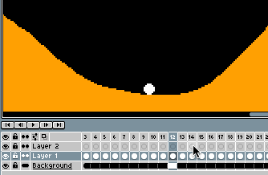
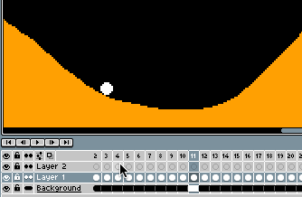

# Onion Skinning

With [onion skinning](https://en.wikipedia.org/wiki/Onion_skinning)
you can see several frames at once in the [sprite editor](sprite-editor.md).
In this way you can use other frames as reference to draw the current one.
You can activate the onion skinning using <kbd>F3</kbd> key or with the little
 icon in the timeline:

You can specify how many previous and next frames do you want to see
and configure other settings from the
 icon (like red/blue tint):

---

**SEE ALSO**

[Animation](animation.md) |
[Timeline](timeline.md)
