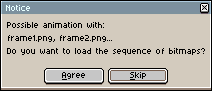

# Open

You can load your sprite and continue working on it using *File > Open* menu.

## Loading image sequences

If you have a sequence of images like:

* `frame0.png`
* `frame1.png`
* `frame2.png`
* ...
* `frameN.png`

You can load this sequence as one animation using *File > Open* menu,
selecting `frame0.png`, and then answering *Yes* to the following
dialog that will appear:

---

**SEE ALSO**

[Save](save.md) |
[Exporting](exporting.md)
