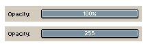
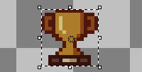
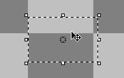
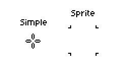
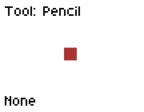
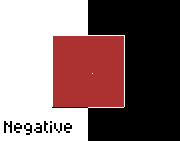
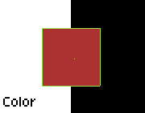
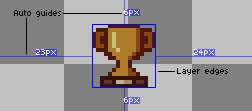
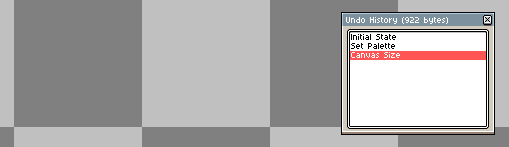

# Preferences

You can change the configuration of Aseprite from the *Edit >
Preferences* menu or pressing <kbd>Ctrl+K</kbd> key (or <kbd>⌘K</kbd>
or <kbd>⌘,</kbd> on macOS). In case that you are looking to configure
the keyboard shortcuts, that's done through
the *[Edit > Keyboard Shortcuts](keyboard-shortcuts.md)* menu option.

The Aseprite preferences are stored in `aseprite.ini` in the [preferences folder](preferences-folder.md).

The Preferences dialog is divided in several sections:

## General

* **User Interface**:

  One window mode : Menus cannot be moved outside of the main Aseprite menu.

  Multi-window mode : Menus can be moved outside of the main Aseprite menu.

* **Light** | **Dark** options: Since v1.3, you can quickly change between
  a Light version of the Aseprite theme and a Dark one.
* **Screen Scaling**: Changes the size of each pixel inside every
  window of Aseprite. It's 200% by default, which means that each
  pixel in the window will be represented with a 2x2 square on the
  screen. When using large monitors (e.g. 4K monitors), you can try
  changing to 300% or 400%. If you want to see each pixel of your
  sprite represented as one pixel on the screen, you should set this
  option to 100%, in this case it's highly probable that you will want
  to increase the next option (*UI Elements Scaling*) to 200% or more
  if needed.
* **UI Element Scaling**: It's an extra scale applied only to elements
  of the User Interface (buttons, labels, etc.), but without modifying
  the scale of the sprite editor. It's 100% by default.
* **Language**: The language of the User Interface, English by default,
  but you can get some translations contributed by users from:
  https://github.com/aseprite/languages.
* **Show Aseprite menu bar** (only available on macOS): The [Aseprite
  menu bar](menu-bar.md) is visible by default on Windows and Linux:

    

  But it's hidden by default on macOS, as in macOS you can use the
  system menu bar:

    

* **Show Aseprite file dialog**: Use custom Aseprite file viewer menu. 
* **Show Home tab when Aseprite is started**: Shows the Home tab when Aseprite is started.
* **Expand menu bar items on mouseover**: With this option checked,
  when the mouse is above the [Aseprite menu bar](menu-bar.md), a menu
  will be opened automatically. By default this is disabled, so you
  have to click a menu to open it.
* **Draw a separation between each palette entry**: Draws a black 1px line between each palette entry in the[ color bar](color-bar.md).
* **Share crash data with Aseprite developers**: When Aseprite crashes
  (unexpectedly closes) you will be asked to share some crash
  information automatically in the future privately with the Aseprite
  team. Aseprite doesn't do this by default (this option is unchecked
  by default), so you have to give your consent to share this
  information.  More details in
  [#2857](https://github.com/aseprite/aseprite/issues/2857).

## Tablet

See the [tablet](tablet.md) section.

## Files

* **Default extensions**: Pick the default file extensions for saving/exporting actions.
* **Recent Items**: The number of recent file/folder items to show on the home page and *File > Open Recent* dropdown.
* **Recover files options**: These options handle the intervals to save sprite recovery data.

## Color

* **Alpha & Opacity Ranges**: Whether alpha/opacity color ranges use `0-255` or `0%-100%` ranges.

  
  
* **Color management**: See the [color profile](color-profile.md) section.

## Alerts

Several (non-undoable) actions on Aseprite show a warning message with
a *Don't show this alert again* checkbox:

You can re-enable these dialogs from *Edit > Preferences > Alerts*.

## Editor

Options to change the general behavior of the [Sprite Editor](sprite-editor.md):

* **Zoom with scroll wheel**: Checked by default, you zoom with the
  [mouse wheel](mouse-wheel.md) (if you uncheck this, the vertical scroll will be the
  default action for the mouse wheel).
* **Zoom sliding two fingers up or down (macOS)**: This is available on macOS
  only, and if you enable it you will be able to zoom using two
  fingers on your MacBook trackpad.
* **Zoom from center with scroll wheel**: Check this if you want to
  [zoom](zoom.md) from the center of the sprite editor instead zooming
  from the mouse position when the mouse wheel is used.
* **Zoom from center with keys**: Zoom from the center of the sprite
  instead of the mouse position when you use the keys
  [to zoom](zoom.md) <kbd>1</kbd>, <kbd>2</kbd>, <kbd>3</kbd>, etc.
* **Show scroll-bars in sprite editor**: Uncheck this to hide the
  scroll bars on all sprite editors.
* **Auto-scroll on editor edges**: With this option checked, when you
  are [drawing](drawing.md) (have the mouse button pressed) and the
  mouse touches the edges of the sprite editor, it will scrolls
  automatically.
* **Auto-fit on screen when a sprite is opened**: When it's checked,
  after you create a new sprite or open an existing one, the editor
  will show the whole image fitting it in the available space of the
  canvas. When this option is unchecked (the default option), the
  initial zoom level will be 100% by default.
* **Preview straight line immediately on Pencil tool**: When you use
  the  Pencil tool, pressing
  the <kbd>Shift</kbd> key will draw a straight line from the last painted
  point. With this option checked, you will see the line preview
  immediately after pressing the <kbd>Shift</kbd> key (instead of
  waiting for the mouse button). If this is too annoying for you, you
  can uncheck the option.
* **Discard custom brush when eyedropper is used**: If you create a
  custom brush with *Edit > New Brush* option, using the eyedropper
   tool will change
  the color of your brush. Checking this option, after picking a color
  with the eyedropper, the custom brush will be completely discarded
  and a regular brush with the picked color will be selected.
* **Downsampling**: The algorithm to use to show the sprite when the
  zoom level is <= 50%. By default it's *Bilinear mipmapping*.
* **Right-click**: You can customize what specific action to do with
  the [right-click](right-click.md).

## Selection

* **Adjust opaque/transparent mode automatically**: Adjust the opaque/transparent mode when moving over a layer, e.g: moving over a transparent layer would set the mode to transparent.
* **Keep selection after "Edit > Delete" command**: Keep the selection bounds after deleting the content.

  

* **Show selection edges automatically when the selection is modified**: Automatically enables *View > Show > Selection Edges* when the selection is moved. This will override the menu setting (e.g: if *View > Show > Selection Edges* is disabled, this will enable it) 
* **Allow moving selection edges**: Enabling this allows moving the selection bounds. The selection can only be moved if the mouse is hovering over its edge (the marching ants).

  

* **Disable transformation handles when key modifiers are pressed**: Disable transformation handles when key modifiers (<kbd>Shift</kbd>/<kbd>Ctrl</kbd>/<kbd>Alt</kbd>) are pressed.
* **Move selection on Add mode**: Enables moving the selection in the [Add selection mode](selecting.md#Add/Subtract/Intersect).
* **Select a grid tile with double-click**: Enables selecting grid tiles with a double-click.
* **Snap To Grid when the option is enabled**: Snap To Grid when *View > Grid > Snap to Grid* is enabled.
* **Force RotSprite even for right/straight angles**: Use the RotSprite rotation algorithm for right/straight angles.
* **Transform cels in selected layers or frames on timeline**: Selection transformations apply to all cels of the selected layers/frames. If this option is disabled, selection transformations will only apply to all selected cels.

## Timeline

* **Show timeline automatically**: Shows the timeline when a new frame or layer is added.
* **Rewind on stop**: Upon stopping, the current frame is reset to the frame the animation was started at (note that it can be a frame other than the first frame).
* **Default First Frame**: Sets the default first frame. 
* **Keep selection**: Keep the timeline selection range when the canvas is edited or the timeline loses focus.
* **Select on Click**: Select frames/cels on click.
* **Select on Shift + Click**: Select frames/cels on <kbd>Shift + Click</kbd>.
* **Select on Drag**: Select frames/cels when dragging.
* **Drag & drop from edges**: Enable dragging and dropping from frame/cel edges.

## Cursors

* **Use native mouse cursors**: Use the OS's cursor. If disabled, use the custom theme cursor.
* **Mouse cursor scale**: Scale of theme cursor.
* **Crosshair Type**: Change the crosshair type when painting.

  

* **Brush Preview**: Change the brush preview type when painting.

   

* **Crosshair & Brush Edges Color**: Change the edge color of the crosshair and brush preview edges.

    

## Background

**Background for New Documents**: Edits the default background for all new documents.

**Background for the Active Document**: Edits the current document background.

* **Size**: Sets the background square sizes.
* **Colors**: Sets the background square colors. 

## Grid

**Grid for New Documents**: Edits the default grid for all new documents.

**Grid for the Active Document**: Edits the current document grid.

* **X & Y**: X and Y grid offsets.
* **Color**: Grid line color.
* **Opacity**: Grid line opacity.
* **Visible Pixel Grid**: Enables/disables the pixel grid.
  * **Color**: Pixel grid line color.
  * **Opacity**: Pixel grid line opacity.

## Guides & Slices

* **Layer Edges Color.**: Layer edge guide color.
* **Auto Guides Color**: Auto guide color.

  

* **Default Color**: Default slice edge color.

## Undo

* **Undo Limit**: The memory limit for undo information, in megabytes, for each sprite.
* **Go to modified frame/layer**: Sets the current frame/layer to the one where the undo occurred.
* **Allow non-linear history**: Undo history is a list of sprite states. If non-linear undo history is disabled and undo is used (which moves the current state back one entry), the next action will overwrite the undone action/state. If it is enabled and undo is used, the next action will add the new sprite state to the list, keeping the old one intact.
  
* **Show Undo Tooltip**: Show the undo tooltip in the bottom right corner of the window.

## Theme

* **Font**: Sets the program font.
* **Mini Font**: Sets the program mini font.

## Extensions

* **Add Extension**: Opens a file dialog to add an extension.
* **Disable**: Disables the selected extension.
* **Uninstall**: Uninstalls the selected extension.
* **Open Folder**: Opens a file dialog in the file location of the selected extension.

## Aseprite Format

* **Cel Content Format**: Changes the cel image format. See https://github.com/aseprite/aseprite/blob/main/docs/ase-file-specs.md#cel-chunk-0x2005.

## Experimental

These features are experimental, and may be removed or changed in the future, which is why they are not listed here.

## Reset

The Reset section contains various editor values to reset.

To reset a value, select it and press the *Reset* button.

---

**SEE ALSO**

[Preferences Folder](preferences-folder.md) |
[Reset Preferences](reset-preferences.md) |
[Keyboard Shortcuts](keyboard-shortcuts.md) |
[Customization](customization.md)
