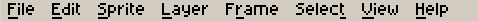
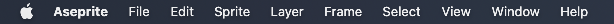
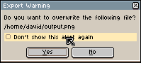

# Preferences

You can change the configuration of Aseprite from the *Edit >
Preferences* menu or pressing <kbd>Ctrl+K</kbd> key (or <kbd>⌘K</kbd>
or <kbd>⌘,</kbd> on macOS). In case that you are looking to configure
the keyboard shorcuts, that's done through
the *Edit > [Keyboard Shortcuts](keyboard-shortcuts.md)* menu option.

The Preferences dialog is divided in several sections:

## General

* **Screen Scaling**: Changes the size of each pixel inside every
  window of Aseprite. It's 200% by default, which means that each
  pixel in the window will be represented with a 2x2 square on the
  screen. When using large monitors (e.g. 4K monitors) you can try
  changing to 300% or 400%. If you want to see each pixel of your
  sprite represented as one pixel on the screen, you should set this
  option to 100%, in this case it's highly probable that you will want
  to increase the next option (*UI Elements Scaling*) to 200% or more
  if needed.
* **UI Elements Scaling**: It's an extra scale applied only to elements
  of the User Interface (buttons, labels, etc.), but without modifying
  the scale of the sprite editor. It's 100% by default.
* **Light** | **Dark** options: Since v1.3 you can quickly change between
  a Light version of the Aseprite theme, and a Dark one.
* **Language**: The language of the User Interface, English by default,
  but you can get some translations contributed by users from:
  https://github.com/aseprite/languages
* **Show Aseprite menu bar** (only available on macOS): The [Aseprite
  menu bar](menu-bar.md) is visible by default on Windows and Linux:

    

  But it's hidden by default on macOS, as in macOS you can use the
  system menu bar:

    

* **Expand menu bar items on mouseover**: With this option checked,
  when the mouse is above the [Aseprite menu bar](menu-bar.md), a menu
  will be opened automatically. By default this is disabled, so you
  have to click a menu to open it.
* **Draw a separation between each palette entry**:
* **Share crash data with Aseprite developers**: When Aseprite crashes
  (unexpectedly closes) you will be asked to share some crash
  information automatically in the future privately with the Aseprite
  team. Aseprite doesn't do this by default (this option is unchecked
  by default), so you have to give your consent to share this
  information.  More details in
  [#2857](https://github.com/aseprite/aseprite/issues/2857)

## Alerts

Several (non-undoable) actions on Aseprite show a warning message with
a *Don't show this alert again* checkbox:

You can re-enable these dialogs from *Edit > Preferences > Alerts*.

## Editor

Options to change the general behavior of the [Sprite Editor](sprite-editor.md):

* **Zoom with scroll wheel**: Checked by default, you zoom with the
  [mouse wheel](mouse-wheel.md) (if you uncheck this, the vertical scroll will be the
  default action for the mouse wheel).
* **Zoom sliding two fingers up or down**: This is available on macOS
  only, and if you enable it you will be able to zoom using two
  fingers on your MacBook trackpad.
* **Zoom from center with scroll wheel**: Check this if you want to
  [zoom](zoom.md) from the center of the sprite editor instead zooming
  from the mouse position when the mouse wheel is used.
* **Zoom from center with keys**: Zoom from the center of the sprite
  instead of the mouse position when you use the keys
  [to zoom](zoom.md) <kbd>1</kbd>, <kbd>2</kbd>, <kbd>3</kbd>, etc.
* **Show scroll-bars in sprite editor**: Uncheck this to hide the
  scroll bars on all sprite editors.
* **Auto-scroll on editor edges**: With this option checked, when you
  are [drawing](drawing.md) (have the mouse button pressed) and the
  mouse touches the edges of the sprite editor, it will scrolls
  automatically.
* **Auto-fit on screen when a sprite is opened**: When it's checked,
  after you create a new sprite or open an existing one, the editor
  will show the whole image fitting it in the available space of the
  canvas. When this option is unchecked (the default option), the
  initial zoom level will be 100% by default.
* **Preview straight line immediately on Pencil tool**: When you use
  the  Pencil tool, pressing
  the <kbd>Shift</kbd> key will draw a straight line from the last painted
  point. With this option checked, you will see the line preview
  immediately after pressing the <kbd>Shift</kbd> key (instead of
  waiting for the mouse button). If this is too annoying for you, you
  can uncheck the option.
* **Discard custom brush when eyedropper is used**: If you create a
  custom brush with *Edit > New Brush* option, using the eyedropper
   tool will change
  the color of your brush. Checking this option, after picking a color
  with the eyedropper, the custom brush will be completely discarded
  and a regular brush with the picked color will be selected.
* **Downsampling**: The algorithm to use to show the sprite when the
  zoom level is <= 50%. By default it's *Bilinear mipmapping*.
* **Right-click**: You can customize what specific action to do with
  the [right-click](right-click.md).

---

**SEE ALSO**

[Preferences Folder](preferences-folder.md) |
[Reset Preferences](reset-preferences.md) |
[Customization](customization.md)
