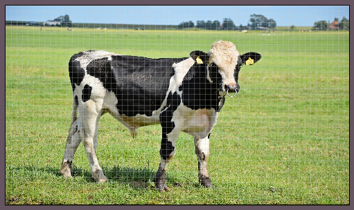

# Reference Layer

> Image taken from [publicdomainpictures.net](https://www.publicdomainpictures.net/en/view-image.php?image=142181).

Reference layers are a way to show reference images at higher resolutions than the canvas. Reference layers cannot be drawn on or edited.

There are a few ways to create a reference layer. To create one from a file, use *Layer > New > New Reference Layer from File*. To paste one in from the clipboard, use *Edit > Paste Special > Paste as New Reference Layer*.

---

**SEE ALSO**

[Layers](layers.md#layers])
