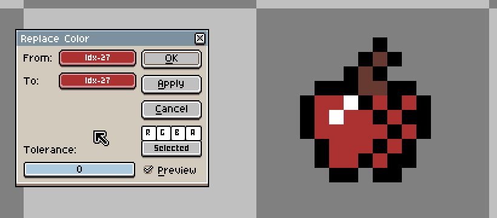

# Replace Color

Replaces a color in a sprite or selection with a different color. Can be accessed with *Edit > Replace Color* or <kbd>Shift+R</kbd>.

* **To**: The color to replace.
* **From**: The color to replace with.
* **Tolerance**: Adjusts how similar colors are replaced, with `0` being only the exact color will be replaced and `255` being all colors will be filled. 
* **RGBA**:
    * The *RGBA* buttons control if a component should be replaced, e.g: the *R* button is checked, so the *R* (red) component will be replaced.
    * The bottom button controls if the replace color should apply to the active timeline selection (*Selected*) or all of the cels in the sprite (*All*). If [a portion of a sprite is selected](selecting.md#selecting): in *Selected* mode it would only apply to the selected content of the selected timeline elements; in *All* mode it would apply to the selected content of all of the sprite's cels. 

---

**SEE ALSO**

[Edit Menu](edit-menu.md#edit-menu) |
[Paint Bucket](context-bar.md#paint-bucket)