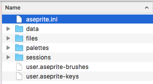

# Reset Preferences

Aseprite preferences are stored in a `aseprite.ini` file in the
configuration folder. You can access this folder from the *Edit >
Preferences > Locate Configuration File*. To reset all configuration
you can close Aseprite and delete all the files where `aseprite.ini` is located:

## On Windows

You can reset preferences on Windows with these steps:

1. Close Aseprite
1. Press the `Windows key + R` (or `Start menu > Run...` option).
   This will show the dialog to run a program. Then you write:

       %AppData%\Aseprite

   And press `Enter` key.
1. Delete the files in that folder (mainly `aseprite.ini`)
1. Restart Aseprite
