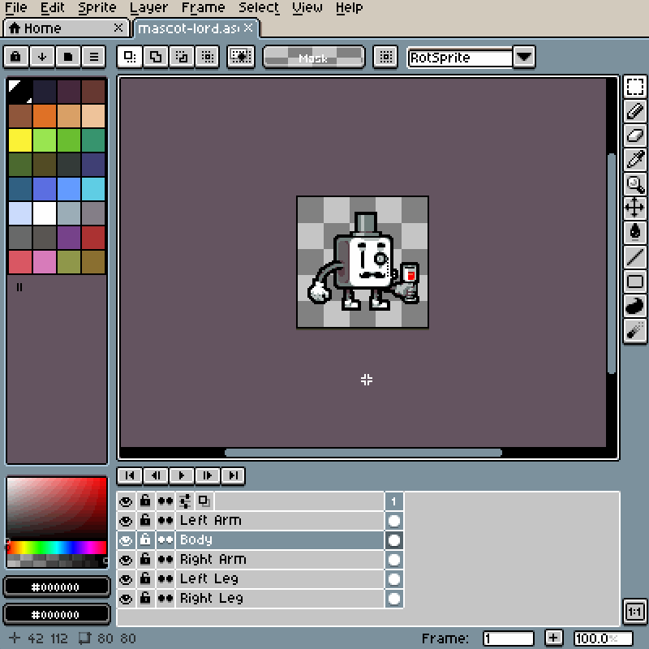
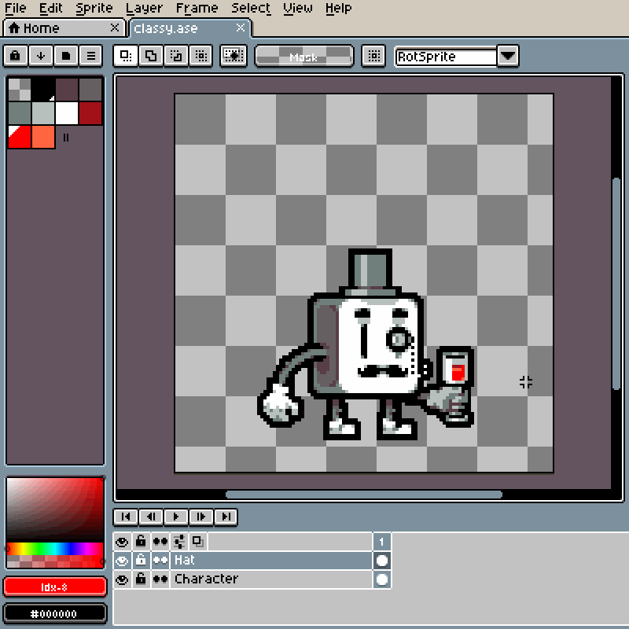

# Resize Sprite or Selection

You can resize your sprite using *Edit > Sprite Size* menu option.

> Note: Resizing a sprite resizes all slices accordingly, changing their position and size.

You can resize a selection using handles.

