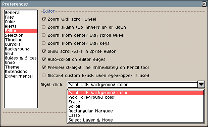

# Right-click

By default, <kbd>Right click</kbd> paints with the [Background Color](color-bar.md#background-color),
but you can change this configuration from *Edit > Preferences > Editor*:

---

**SEE ALSO**

[Basics](basics.md) |
[Sprite Editor](sprite-editor.md)
