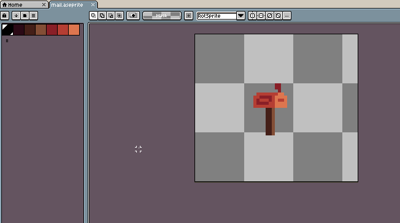
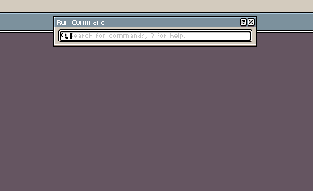
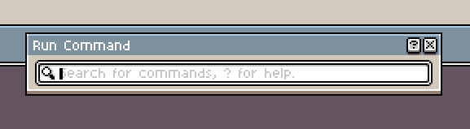
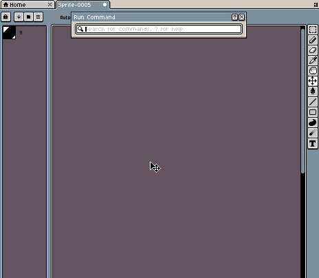

# Run Command

The Run Command window can run any option from the [menu bar](menu-bar.md#menu-bar), any installed script, or any command from the [keyboard shortcuts](keyboard-shortcuts.md#keyboard-shortcuts) menu. It can be accessed with *View > Run Command* or <kbd>Ctrl+Space</kbd>.

## Running a Command

To run a command, search the name of the command you want to run in the search box. Below the search box, search results will appear. Press <kbd>Enter</kbd> to execute the first result; use the arrow keys to pick other results.

## Math Expressions

The Run Command window supports math expressions. To enter a math expression, type <kbd>=</kbd> (equals sign) followed by a math expression. The result will be shown below the entry box. If the math expression is invalid (e.g: there is an unclosed parenthesis) then the result will be `NaN`.

### Supported Symbols, Constants, & Functions

| Symbol | Description 
|-|-
| `+` | Add
| `-` | Subtract/Negate 
| `*` | Multiply
| `/` | Divide
| `^` | Exponent/Power
| `%` | [Modulus](https://en.wikipedia.org/wiki/Modulo) (remainder divide)

| Constant | Description 
|-|-
| `pi` | The value of [Pi](https://en.wikipedia.org/wiki/Pi) (`3.14159...`).
| `e` | E for use in [scientific notation](https://en.wikipedia.org/wiki/Scientific_notation#E_notation), e.g (`2.4e8`).

**Supported Functions:**
* `abs(x)` 
* `acos(x)`
* `asin(x)`
* `atan(x)`
* `atan2(x, y)`
* `ceil(x)`
* `cos(x)`
* `cosh(x)`
* `exp(x)`
* `floor(x)`
* `ln(x)`
* `log(x)`
* `log10(x)`
* `pow(x, y)`
* `sin(x)`
* `sinh(x)`
* `sqrt(x)`
* `tan(x)`
* `tanh(x)`

## Inline Lua Expressions

The Run Command window supports inline [Lua](https://www.lua.org/) code. To start a codeline, type <kbd>@</kbd>.

Global variables and functions can be created and accessed with another Run Command codeline; the variables and functions are reset after the Aseprite instance is closed.

---

**SEE ALSO**

[Keyboard Shortcuts](keyboard-shortcuts#keyboard-shortcuts.md)